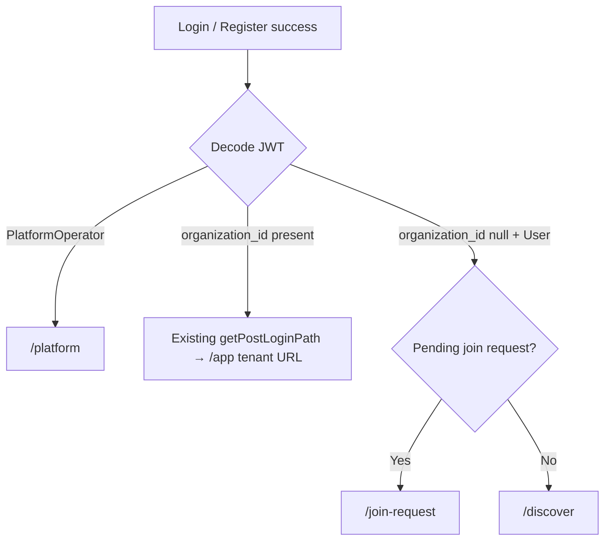

# FE Handoff: Org Join Request (Employee Self-Onboard)

**Date:** 2026-06-01  
**Backend spec:** [plans/org-join-request/spec.md](../../plans/org-join-request/spec.md)  
**Related:** [self-serve-org-handoff.md](./self-serve-org-handoff.md) (org register, package gate, tenant URL)  
**Replaces (partially):** old location-level `/join` + `/pending` removed 2026-05-29 — **new flow is org-level**, user has **no Employee** until admin approves.

---

## 1. Tóm tắt — FE phải làm gì

| Hiện tại | Sau (bổ sung song song) |
| -------- | ----------------------- |
| Nhân viên chỉ vào org khi Admin tạo qua `POST /employees` | Thêm luồng: **tự đăng ký → chọn org → chờ duyệt → vào `/app`** |
| `POST /register` luôn tạo org + Admin | Thêm **`POST /api/v1/auth/register-employee`** — User **không có** `organization_id` |
| Login xong luôn có org (trừ PlatformOperator) | User org-less → shell riêng **`/discover`** + **`/join-request`** |
| Admin không có inbox yêu cầu tham gia | Thêm **`/{orgId}/admin/join-requests`** + badge sidebar |

**Admin tạo staff thủ công vẫn giữ nguyên** — không xóa form `POST /employees`.

---

## 2. Routing & guards (net-new)

### 2.1 Post-login decision tree



### 2.2 Route table

| Route | Auth | Mô tả |
| ----- | ---- | ----- |
| `/login` | Anonymous | Giữ nguyên |
| `/register` | Anonymous | **Hub 2 lựa chọn** (xem §3.1) |
| `/register/org` | Anonymous | Form tạo org (move từ `/register` cũ) |
| `/register/employee` | Anonymous | Form đăng ký nhân viên (email, password, profile) |
| `/discover` | User, `organization_id = null` | Danh bạ org (gói active) |
| `/join-request` | User, `organization_id = null` | Trạng thái pending / rejected |
| `/{orgId}/admin/join-requests` | Admin | Inbox duyệt yêu cầu |
| `/app`, `/{orgId}/…` | User/Manager/Admin **có org** | **Cấm** org-less user |

### 2.3 `OrgLessGate` (component mới)

- **Cho phép:** `/discover`, `/join-request`, `/login`, `/register/*`
- **Redirect:** mọi path org shell → `/discover` (hoặc `/join-request` nếu đang pending)
- **`proxy.ts`:** phải `NextResponse.next()` cho `/discover` và `/join-request` khi JWT `User` + không có `organization_id` — nếu không middleware redirect `/discover` → `/discover` gây `ERR_TOO_MANY_REDIRECTS`
- **JWT:** `role === 'User'` && `!organizationId`
- **Đã có org:** `proxy.ts` + `resolveAppLandingPath` đưa về `/{orgId}/{locationId}/user/dashboard` (fetch membership nếu chưa có chi nhánh cookie)
- **Không** dùng lại `MembershipGate` / `/join` / `/pending` cũ (location-level, đã bỏ)

---

## 3. Màn hình mới (UI chưa có — cần build)

### 3.1 `/register` — Auth hub

Hai card/link rõ ràng:

| Lựa chọn | Copy gợi ý | Navigate |
| -------- | ---------- | -------- |
| Tạo tổ chức mới | "Tôi là chủ/quản lý, muốn đăng ký doanh nghiệp trên Wokki" | `/register/org` |
| Tôi là nhân viên | "Tôi muốn tham gia công ty đã có trên Wokki" | `/register/employee` |

Footer: "Đã có tài khoản? **Đăng nhập**"

### 3.2 `/register/employee` — Employee signup

**Fields (MVP — align với BE khi plan chốt):**

| Field | Required | Note |
| ----- | -------- | ---- |
| email | ✓ | |
| password | ✓ | Same strength rules as org register |
| confirmPassword | ✓ | Client only |
| firstName | ✓ | `[NEEDS CLARIFICATION]` |
| lastName | ✓ | |
| phone | optional | |

**Submit:** `POST /api/v1/auth/register-employee`

**Success 201:** lưu tokens → redirect **`/discover`**

**Errors:** `409 USER_EXISTS` → link login; validation → inline field errors

### 3.3 `/discover` — Org directory

**Layout:**

```
┌─────────────────────────────────────────┐
│  Tìm nơi làm việc của bạn              │
│  [🔍 Tìm theo tên org...            ]   │
├─────────────────────────────────────────┤
│  ┌─────────────────────────────────┐   │
│  │ Cafe Sunrise                    │   │
│  │                    [Gửi yêu cầu]│   │
│  └─────────────────────────────────┘   │
│  ┌─────────────────────────────────┐   │
│  │ Bistro Moon                     │   │
│  │                    [Gửi yêu cầu]│   │
│  └─────────────────────────────────┘   │
│  ... pagination ...                     │
└─────────────────────────────────────────┘
```

**API:** `GET /api/v1/organizations/directory?page=&pageSize=&search=`

**Response item:** `{ id, name }` only — không hiện địa chỉ, admin, số chi nhánh.

**Behaviors:**

- Chỉ org **gói active** (BE filter)
- User đã có **pending request** → ẩn nút "Gửi yêu cầu" toàn trang; banner "Bạn đang chờ duyệt tại **{orgName}**" + link **`/join-request`**
- Click **Gửi yêu cầu** → confirm dialog → `POST /api/v1/org-join-requests` body `{ organizationId }` → redirect **`/join-request`**
- Empty state: "Chưa có tổ chức nào trên Wokki" (hiếm — chỉ khi directory rỗng)
- Header: email user + **Đăng xuất**

### 3.4 `/join-request` — Pending / rejected state

**Pending:**

```
┌─────────────────────────────────────────┐
│  ⏳ Đang chờ duyệt                      │
│  Bạn đã gửi yêu cầu tham gia             │
│  **Cafe Sunrise**                        │
│  Gửi lúc: 01/06/2026 14:30              │
│                                         │
│  Quản trị viên sẽ xem xét và gán        │
│  chi nhánh/phòng ban cho bạn.           │
│                                         │
│  [Hủy yêu cầu]  (optional P2)           │
└─────────────────────────────────────────┘
```

**Rejected:**

```
┌─────────────────────────────────────────┐
│  Yêu cầu không được chấp nhận           │
│  **Cafe Sunrise** — Lý do: ...          │
│  [Chọn tổ chức khác → /discover]        │
└─────────────────────────────────────────┘
```

**API:** `GET /api/v1/org-join-requests/me` → `{ id, organizationId, organizationName, status, submittedAt, rejectedNote? }`

**Poll / refresh:** on focus or manual refresh; optional P2 polling 30s

**Approved (edge — user still on this page):** detect `organization_id` in JWT after refresh → `getPostLoginPath()` → employee `/app`

### 3.5 Admin — `/{orgId}/admin/join-requests`

**Không** hiển thị `FoundationScopePicker` / filter phòng ban trên trang — inbox org-wide; chi nhánh + phòng ban chỉ chọn trong modal **Duyệt**.

**Sidebar:** mục **Yêu cầu tham gia** với badge số pending (giống pattern notification count nếu có).

**Table columns:**

| Cột | Nguồn |
| --- | ----- |
| Email | requester |
| Họ tên | requester profile |
| Gửi lúc | submittedAt |
| Hành động | Duyệt / Từ chối |

**API list:** `GET /api/v1/org-join-requests/pending`

### 3.6 Admin — Approve modal

Reuse UI patterns từ **Tạo nhân viên** (`CreateEmployeeForm`):

| Field | Required | Note |
| ----- | -------- | ---- |
| Chi nhánh | ✓ | Filter departments |
| Phòng ban (`departmentId`) | ✓ | Same as `POST /employees` User |
| hourlyRate | ✓ | `[NEEDS CLARIFICATION]` |
| phone | optional | Pre-fill from requester if available |

**Submit:** `PATCH /api/v1/org-join-requests/{id}/approve` with approve body

**Success:** close modal, remove row, toast "Đã thêm {name} vào tổ chức"

**Không** hiển thị temporary password — user đã tự đặt mật khẩu lúc register.

### 3.7 Admin — Reject

Dialog: optional note (max 500 chars) → `PATCH .../reject` → row removed

---

## 4. Auth API (contract dự kiến — BE implement theo spec)

Base: `/api/v1/auth`, `/api/v1/org-join-requests`, `/api/v1/organizations`

### 4.1 Register employee (org-less)

```http
POST /api/v1/auth/register-employee
Content-Type: application/json

{
  "email": "lan@gmail.com",
  "password": "SecurePass1!",
  "firstName": "Lan",
  "lastName": "Nguyen",
  "phone": ""
}
```

**Response 201** — same shape as login (`accessToken`, `refreshToken`). JWT: `role=User`, **no** `organization_id`.

### 4.2 Org directory

```http
GET /api/v1/organizations/directory?page=1&pageSize=20&search=cafe
Authorization: Bearer {token}   # org-less User or anonymous TBD
```

**Response:** paged `{ id, name }[]`

### 4.3 Submit join request

```http
POST /api/v1/org-join-requests
Authorization: Bearer {orgLessUserToken}

{ "organizationId": "uuid" }
```

**409** if pending exists: `ORG_JOIN_PENDING_EXISTS`

### 4.4 My request status

```http
GET /api/v1/org-join-requests/me
Authorization: Bearer {orgLessUserToken}
```

**200** `{ ... }` | **404** no request → FE shows link to `/discover`

### 4.5 Admin pending list

```http
GET /api/v1/org-join-requests/pending
Authorization: Bearer {adminToken}
```

### 4.6 Approve / reject

```http
PATCH /api/v1/org-join-requests/{id}/approve
Authorization: Bearer {adminToken}

{
  "departmentId": "uuid",
  "hourlyRate": 35000,
  "phone": ""
}
```

```http
PATCH /api/v1/org-join-requests/{id}/reject
Authorization: Bearer {adminToken}

{ "note": "optional" }
```

---

## 5. Auth store & guards (wokki-client checklist)

| Task | File / area (gợi ý) |
| ---- | --------------------- |
| `organizationId` nullable in auth store | existing auth slice |
| `getPostLoginPath` branch for org-less User | `lib/support/routing/` |
| `OrgLessGate` layout wrapper | `components/shared/org-less-gate.tsx` (new) |
| Register hub + employee form pages | `app/register/` |
| Discover page | `app/discover/page.tsx` (new) |
| Join request status page | `app/join-request/page.tsx` (new) |
| Admin join requests page | `app/[orgId]/admin/join-requests/` (new) |
| API hooks | `hooks/useOrgDirectory`, `useOrgJoinRequest`, `useAdminJoinRequests` |
| i18n keys | `vi` + `en` for all copy above |

---

## 6. Error codes (FE mapping)

| Code | HTTP | UI |
| ---- | ---- | -- |
| `USER_EXISTS` | 409 | Register employee → "Email đã dùng, đăng nhập?" |
| `ORG_JOIN_PENDING_EXISTS` | 409 | Discover submit → redirect `/join-request` |
| `ORG_JOIN_NOT_FOUND` | 404 | Org removed from directory |
| `ORG_PACKAGE_NOT_ACTIVATED` | 402 | Discover: org không còn nhận request |
| `ORG_JOIN_ALREADY_MEMBER` | 409 | Should not happen for org-less shell |

---

## 7. Out of scope (FE)

- Manager self-onboard UI
- Multi-org switcher
- Email/push notification on approve/reject (P3)
- Platform operator join-request queue
- Reviving old `/join` location picker

---

## 8. Test plan (FE)

- [ ] Register employee → lands `/discover`, cannot open `/app` or admin onboarding
- [ ] Submit request → `/join-request` pending UI; second submit blocked
- [ ] Admin approve with department → candidate login → employee `/app` with correct branch
- [ ] Admin reject → candidate sees rejected state → can return `/discover`
- [ ] Org register path (`/register/org`) unchanged
- [ ] Admin manual `POST /employees` flow unchanged
