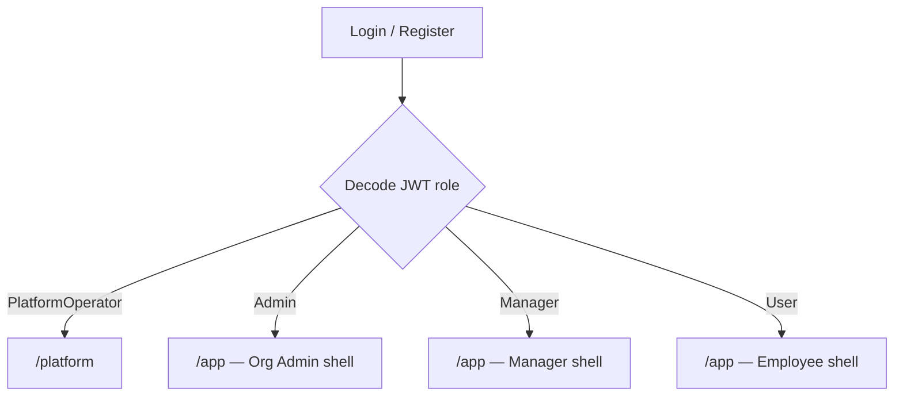
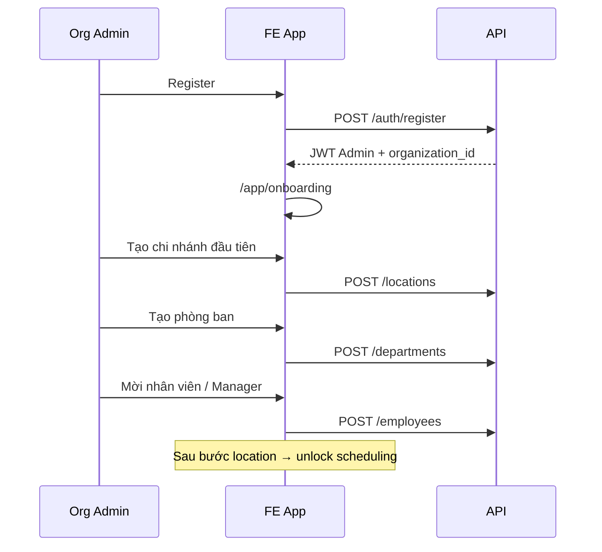
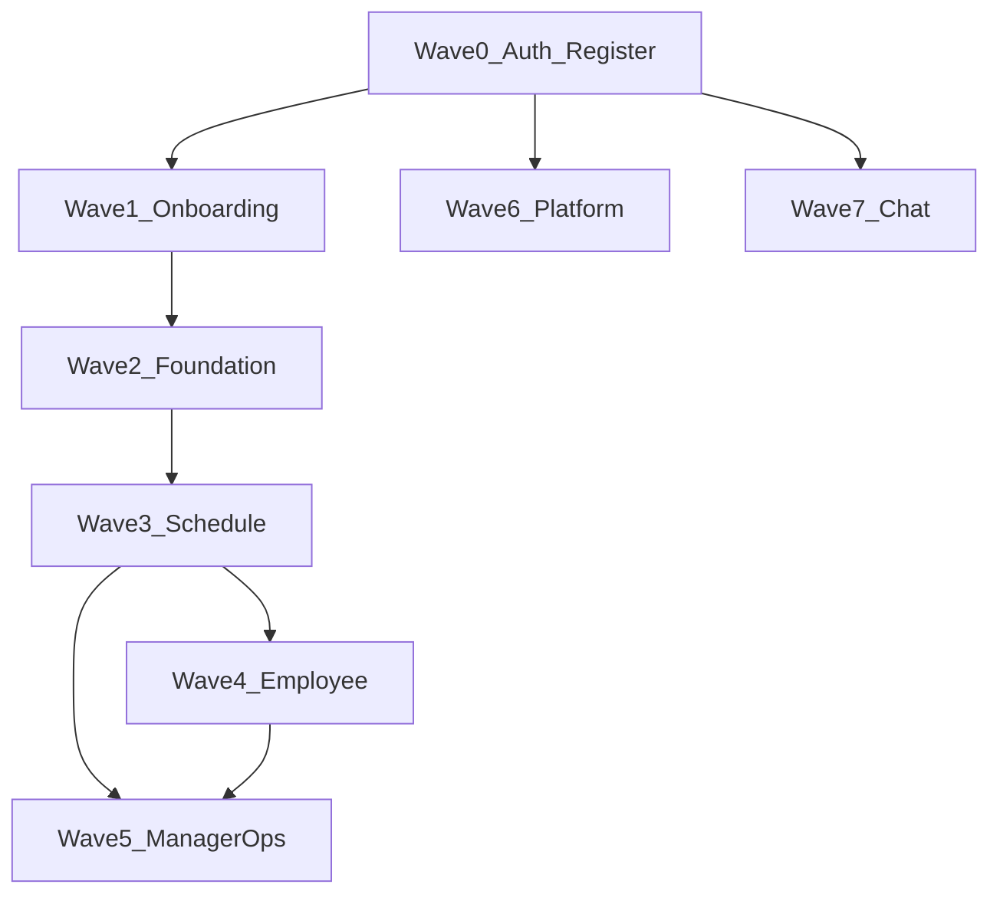

# FE Handoff: Self-serve Organization (multi-tenant)

**Date:** 2026-05-29  
**Backend spec:** [plans/self-serve-org/spec.md](../../plans/self-serve-org/spec.md)  
**API catalog:** [docs/api-catalog.md](../api-catalog.md)  
**Business rules:** [docs/business-rules.md](../business-rules.md) (BR-014 → BR-019)
**Tiếng Việt (luồng cũ MVP):** [docs/vi/fe-integration-guide.md](../vi/fe-integration-guide.md) — **phần seed/demo đã lỗi thời; ưu tiên tài liệu này**

---

## 1. Tóm tắt thay đổi — FE phải làm gì

| Trước (demo single-tenant)                                           | Sau (self-serve org)                                                                                  |
| -------------------------------------------------------------------- | ----------------------------------------------------------------------------------------------------- |
| Login 3 account seed (`admin`/`manager`/`user`) vào cùng 1 quán demo | **Register** tạo org mới → user là **Org Admin**; hoặc login account do Admin tạo                     |
| `admin@gmail.com` = Admin toàn DB                                    | `admin@gmail.com` = **`PlatformOperator`** — vào **platform console**, **không** vào app vận hành org |
| Không có register tạo org                                            | **`POST /register`** bắt buộc có `organizationName`                                                   |
| Register xong dùng app ngay                                          | Org mới **chưa có gói**; Wokki admin phải kích hoạt/gia hạn trong `/platform`                         |
| DB seed sẵn location/dept/schedule                                   | **Org mới = DB trống** — Admin phải **onboarding** (tạo chi nhánh → phòng ban → nhân viên)            |
| Admin thấy mọi chi nhánh mọi org                                     | Mọi API business **scoped theo JWT `organization_id`**                                                |
| Không có dashboard tổng platform                                     | Route **`/platform`** + stats + list user/org + bật/tắt gói org                                       |
| Manager/Admin không có org dashboard                                 | `GET /api/v1/org/stats` (Admin + Manager)                                                             |
| Nhân viên tự gửi yêu cầu tham gia chi nhánh (`/join`, `/pending`)    | **Bỏ hẳn** — Admin tạo account + gán phòng ban → membership Active tự động                            |
| Admin tạo "tài khoản hệ thống" riêng                                 | **Bỏ hẳn** — tạo staff bằng `POST /employees`; BE tạo cả `User` + `Employee`                          |

**Có thể bỏ / viết lại hoàn toàn:** màn hình seed demo, **`/join`**, **`/pending`**, duyệt membership, `MembershipGate` redirect join, tab/form **Tài khoản hệ thống** trong org.

---

## 2. Hai loại người dùng (routing gốc)



Nhân viên (`User`) do Org Admin tạo qua `POST /employees` — **không** qua `/join`. Membership Active được BE tạo tự động từ `departmentId`.

### 2.1 JWT claims (decode sau login/register)

| Claim             | Org user                       | PlatformOperator   |
| ----------------- | ------------------------------ | ------------------ |
| `sub`             | userId                         | userId             |
| `email`           | email                          | email              |
| `role`            | `Admin` \| `Manager` \| `User` | `PlatformOperator` |
| `organization_id` | **UUID org** (bắt buộc)        | **Không có**       |

**FE:** lưu `role` + `organizationId` (nullable) trong auth store. Mọi request business gửi `Authorization: Bearer {accessToken}` — **không** gửi `organizationId` trong body để authorize.

### 2.2 Route guard (đề xuất thay shell hiện tại)

| Route prefix                            | Cho phép                                          | Ghi chú                     |
| --------------------------------------- | ------------------------------------------------- | --------------------------- |
| `/login`, `/register`                   | Anonymous                                         | Public                      |
| `/platform`                             | `PlatformOperator` only                           | Không sidebar org           |
| `/{orgId}/…`, `/{orgId}/{locationId}/…` | `Admin`, `Manager`, `User` (có `organization_id`) | App vận hành org — xem §2.3 |

**Đã bỏ:** `/join`, `/pending`, `MembershipGate` redirect join, màn duyệt yêu cầu tham gia.

**PlatformOperator** gọi API org (`/locations`, `/schedules`, …) sẽ fail scope — **không** route họ vào app org.

**Org package gate:** nếu login/refresh/API trả `ORG_PACKAGE_NOT_ACTIVATED` hoặc `ORG_PACKAGE_EXPIRED`, FE xoá session org hiện tại và đưa về màn thông báo gói sử dụng, không render shell `/app`.

### 2.3 URL tenant + chi nhánh (Hướng B)

Mọi màn vận hành org dùng **orgId** và (khi cần) **locationId** trên URL. JWT `organization_id` phải **khớp** `[orgId]`; lệch → redirect về home theo role.

| Loại route    | Pattern                                          | Ví dụ                                                                     |
| ------------- | ------------------------------------------------ | ------------------------------------------------------------------------- |
| Branch-scoped | `/{orgId}/{locationId}/{Admin\|Manager\|User}/…` | `…/admin/workspace`, `…/admin/schedule`                                   |
| Org-only      | `/{orgId}/{Admin\|Manager\|User}/…`              | `…/admin/onboarding`; `…/admin/workspace` only redirects/selects a branch |

Sidebar and workspace actions must use the selected `locationId`. Do not render all org branches inside the branch workspace; a true all-branch Admin view must be a separate org-level feature.

**Không** gửi `orgId` trong body API — BE vẫn scope bằng JWT.

| Hành vi FE      | Chi tiết                                                                |
| --------------- | ----------------------------------------------------------------------- |
| Post-login      | `getPostLoginPath` / `getOrgAdminLandingPath`                           |
| Đổi chi nhánh   | Sidebar **BranchSwitcher** + `useTenantNavigation.switchBranch`         |
| Legacy bookmark | `proxy.ts` redirect `/admin/*` khi có JWT org + cookie `wokki:branchId` |

**Code (wokki-client):** `lib/support/routing/tenant-routes.ts`, `components/shared/tenant-scope-guard.tsx`, `hooks/useTenantNavigation.ts`, `proxy.ts`.

---

## 3. Auth API (contract mới)

Base: `/api/v1/auth`

### 3.1 Register — tạo org + Org Admin (luồng chính cho khách mới)

```http
POST /api/v1/auth/register
Content-Type: application/json

{
  "email": "owner@cafe.vn",
  "password": "SecurePass1!",
  "organizationName": "Cafe Sunrise"
}
```

**Response 201** — cùng shape login:

```json
{
  "success": true,
  "data": {
    "accessToken": "eyJ...",
    "refreshToken": "..."
  },
  "message": {"code": "USER_CREATED", "text": "...", "statusCode": 201}
}
```

**Sau register:** decode JWT → `role === "Admin"`, có `organization_id`, nhưng org đang **NotActivated**. FE nên redirect tới màn chờ kích hoạt/gói sử dụng thay vì onboarding. Khi Wokki admin bật gói, lần login sau mới vào `/app/onboarding`.

| Status | Code          | Xử lý FE                    |
| ------ | ------------- | --------------------------- |
| 409    | `USER_EXISTS` | Email đã dùng — gợi ý login |
| 400    | validation    | Hiển thị `errors[]`         |

**UI Register form (bắt buộc 3 field):**

- Email
- Password
- **Tên tổ chức** (`organizationName`) — hiển thị rõ: "Tên quán / công ty của bạn"

### 3.2 Login

```http
POST /api/v1/auth/login
{ "email": "...", "password": "..." }
```

Routing sau login:

| role               | organization_id | Điều hướng                                    |
| ------------------ | --------------- | --------------------------------------------- |
| `PlatformOperator` | absent          | `/platform`                                   |
| `Admin`            | present         | `/app` (hoặc onboarding nếu chưa có location) |
| `Manager`          | present         | `/app`                                        |
| `User`             | present         | `/app` (employee features)                    |

Login/refresh có thể fail vì gói org:

| Status | Code                        | Copy FE                                       |
| ------ | --------------------------- | --------------------------------------------- |
| 403    | `ORG_PACKAGE_NOT_ACTIVATED` | "Bạn chưa có gói sử dụng hệ thống."           |
| 402    | `ORG_PACKAGE_EXPIRED`       | "Bạn phải gia hạn để tiếp tục dùng hệ thống." |

### 3.3 Các endpoint auth khác (giữ nguyên)

| Method | Path                    | Ghi chú                                                    |
| ------ | ----------------------- | ---------------------------------------------------------- |
| GET    | `/auth/me`              | Profile tài khoản (email, role) — **không** thay `/self/*` |
| POST   | `/auth/refresh-token`   | `{ refreshToken }`                                         |
| PUT    | `/auth/change-password` | Authenticated                                              |
| POST   | `/auth/logout`          | Authenticated                                              |

### 3.4 Seed dev (chỉ platform)

| Email             | Password    | Role               | Dùng cho         |
| ----------------- | ----------- | ------------------ | ---------------- |
| `admin@gmail.com` | `12345@Abc` | `PlatformOperator` | Test `/platform` |

**Không còn** seed `manager@gmail.com`, `user@gmail.com`, demo schedule. Muốn test Manager/User: Org Admin tạo employee qua API.

---

## 4. Stats API (màn hình mới)

### 4.1 Platform — `/platform`

```http
GET /api/v1/platform/stats
Authorization: Bearer {platformOperatorToken}
```

**Response `data`:**

```typescript
interface PlatformStatsResponse {
  organizationCount: number
  userCount: number // org users only (excludes PlatformOperator)
  locationCount: number
  employeeCount: number // non-terminated
}
```

**403** nếu không phải `PlatformOperator`.

**UI gợi ý:** dashboard platform gồm 4 thẻ số + bảng org/user bên dưới. Không link PlatformOperator vào schedule/payroll org.

### 4.1.1 Platform user/org management — Wokki admin

```http
GET /api/v1/platform/users?page=1&pageSize=20&search=&organizationId=&role=
GET /api/v1/platform/organizations?page=1&pageSize=20&search=
PUT /api/v1/platform/organizations/{organizationId}/subscription
Authorization: Bearer {platformOperatorToken}
```

`GET /platform/users` response `data.items[]`:

```typescript
interface PlatformUserResponse {
  id: string
  email: string
  role: 'PlatformOperator' | 'Admin' | 'Manager' | 'User'
  organizationId: string | null
  organizationName: string | null
  createdAt: string
}
```

`GET /platform/organizations` response `data.items[]`:

```typescript
type SubscriptionStatus = 'NotActivated' | 'Active' | 'Expired' | 'Disabled'

interface PlatformOrganizationResponse {
  id: string
  name: string
  isActive: boolean
  subscriptionStatus: SubscriptionStatus
  subscriptionEnabled: boolean
  subscriptionDurationDays: number
  subscriptionActivatedAt: string | null
  subscriptionExpiresAt: string | null
  subscriptionUpdatedAt: string | null
  createdAt: string
  userCount: number
  locationCount: number
  employeeCount: number
}
```

Body bật/gia hạn gói — **số ngày do Wokki admin chọn** trên platform console; FE gửi `durationDays` từ input admin, **không** hardcode 30:

```json
{
  "enabled": true,
  "durationDays": 90
}
```

`durationDays` optional trên API (`1..3650`): khi bật/gia hạn, FE nên luôn gửi giá trị admin vừa nhập; nếu bỏ qua, BE dùng `subscriptionDurationDays` đã lưu của org. Khi bật, hạn mới = `now + durationDays`. `enabled: false` → chặn org, không xoá dữ liệu.

FE nên dùng `subscriptionStatus` để hiển thị badge:

| Status         | UI                                    |
| -------------- | ------------------------------------- |
| `NotActivated` | Chưa có gói                           |
| `Active`       | Đang hoạt động, hiển thị ngày hết hạn |
| `Expired`      | Hết hạn, CTA gia hạn                  |
| `Disabled`     | Org bị tắt                            |

### 4.2 Org stats — Admin + Manager

```http
GET /api/v1/org/stats
Authorization: Bearer {orgUserToken}
```

**Response `data`:**

```typescript
interface OrgStatsResponse {
  organizationId: string
  userCount: number
  locationCount: number
  departmentCount: number
  employeeCount: number
  activeLocationMembershipCount: number
}
```

| Role             | Kết quả |
| ---------------- | ------- |
| Admin, Manager   | 200     |
| User             | 403     |
| PlatformOperator | 403     |

**UI:** tab "Tổng quan" trên `/app` — Manager **read-only** (cùng API).

---

## 5. Luồng onboarding org mới (thay demo seed)

Org vừa register **không có** location, department, employee, schedule. **Bỏ** assumption "Main Office đã có sẵn".



### 5.1 Bước onboarding (Admin)

| Step | API                                        | Body mẫu                                                                      | Lưu state                  |
| ---- | ------------------------------------------ | ----------------------------------------------------------------------------- | -------------------------- |
| 1    | `POST /locations`                          | `{ "name": "Chi nhánh 1", "address": "...", "timeZone": "Asia/Ho_Chi_Minh" }` | `locationId`               |
| 2    | `POST /departments`                        | `{ "locationId": "...", "name": "Quầy bar" }`                                 | `departmentId`             |
| 3    | `POST /employees`                          | xem §5.2                                                                      | `employeeId`, mật khẩu tạm |
| 4    | (tuỳ chọn) `POST /locations/{id}/managers` | gán Manager user                                                              |                            |
| 5    | `POST /shifts`                             | định nghĩa ca                                                                 | `shiftDefinitionId`        |
| 6    | `POST /schedules` + assignments + publish  | như MVP cũ                                                                    |                            |

**Empty state:** nếu `GET /org/stats` → `locationCount === 0`, luôn hiện onboarding wizard thay dashboard trống.

### 5.2 Tạo nhân viên (thay register cho staff)

**Nhân viên không tự register.** Org Admin:

```http
POST /api/v1/employees
Authorization: Bearer {adminToken}

{
  "email": "barista@cafe.vn",
  "firstName": "Lan",
  "lastName": "Nguyen",
  "phone": "",
  "position": "Barista",
  "hourlyRate": 35000,
  "departmentId": "{uuid}",
  "role": "User",
  "password": null
}
```

Response có `temporaryPassword` — hiển thị **một lần** cho Admin copy gửi nhân viên.

Nhân viên → **Login** (không register) → vào **`/app` trực tiếp**. BE tự tạo **Active** `LocationMembership` tại chi nhánh của `departmentId`.
Nếu email đã tồn tại trong cùng org nhưng chưa có `Employee` (dữ liệu legacy từ tab “Tài khoản hệ thống”), gọi API này với email đó sẽ chuyển account thành nhân viên và trả mật khẩu tạm mới.

**Không dùng `POST /api/v1/users` để tạo staff.** Endpoint này bị chặn cho org staff (`USER_EMPLOYEE_PROFILE_REQUIRED`) vì tài khoản không có `Employee` sẽ không có phòng ban/chi nhánh, không xem được lịch, chấm công, chat hoặc route `/user`.

---

## 6. Chi nhánh nhân viên — không còn luồng join

**Đã bỏ (BE + FE):**

- Route `/join`, `/pending`
- `POST /api/v1/location-memberships/request`
- `GET /api/v1/location-memberships/pending`
- `PATCH /api/v1/location-memberships/{id}/review`
- `MembershipGate` redirect join

**Còn lại (tuỳ chọn UI):**

```http
GET /api/v1/location-memberships/my
```

Trả membership **Active** — dùng hiển thị chi nhánh hiện tại trên header/profile, không dùng làm gate.

**Đổi chi nhánh** (Admin/Manager): `POST /api/v1/workspace/location/transfer` — không phải luồng nhân viên tự request.

---

## 7. Map màn hình đề xuất (thay component tree cũ)

### 7.1 Public

| Màn          | Route              | API                                          |
| ------------ | ------------------ | -------------------------------------------- |
| Login        | `/login`           | `POST /auth/login`                           |
| Register org | `/register`        | `POST /auth/register` (+ `organizationName`) |
| Quên MK      | `/forgot-password` | `POST /auth/forgot-password`                 |

### 7.2 Platform (PlatformOperator only)

| Màn                | Route                                                | API                                                                            |
| ------------------ | ---------------------------------------------------- | ------------------------------------------------------------------------------ |
| Platform dashboard | `/platform`                                          | `GET /platform/stats`                                                          |
| Users hệ thống     | `/platform/users` hoặc tab trong `/platform`         | `GET /platform/users`                                                          |
| Orgs + gói sử dụng | `/platform/organizations` hoặc tab trong `/platform` | `GET /platform/organizations`, `PUT /platform/organizations/{id}/subscription` |
| (optional) Logout  | —                                                    | `POST /auth/logout`                                                            |

**Sidebar:** không có Locations, Schedules, Employees.

### 7.3 Org app — shell chung `/app`

**Header:** hiển thị tên org (lấy từ register hoặc lưu local sau login — BE chưa có `GET /organizations/me`; có thể cache `organizationName` từ form register hoặc thêm API sau).

| Màn               | Admin              | Manager                  | User               |
| ----------------- | ------------------ | ------------------------ | ------------------ |
| Tổng quan org     | `/app`             | `/app` (read-only stats) | —                  |
| Onboarding wizard | `/app/onboarding`  | —                        | —                  |
| Chi nhánh         | `/app/locations`   | scoped                   | —                  |
| Phòng ban         | `/app/departments` | scoped                   | —                  |
| Nhân viên         | `/app/employees`   | scoped                   | —                  |
| Lịch tuần         | `/app/schedules`   | scoped                   | —                  |
| Ca của tôi        | —                  | —                        | `/app/my-schedule` |
| Đổi ca            | —                  | —                        | `/app/swaps`       |
| Chấm công         | —                  | —                        | `/app/attendance`  |
| Payroll           | `/app/payroll`     | read                     | —                  |
| Chat              | `/app/chat`        | ✓                        | ✓ (có Employee)    |

### 7.4 Icon / nav (gợi ý wokki-client)

| Item               | Icon (đã có)          | Ghi chú                      |
| ------------------ | --------------------- | ---------------------------- |
| Dashboard org      | `LayoutDashboardIcon` | Stats cards                  |
| Tổ chức / cấu trúc | `NetworkIcon`         | Locations + departments tree |
| Platform           | riêng shell           | Không dùng org sidebar       |

---

## 8. API business — không đổi path, đổi **data**

Các endpoint MVP **giữ nguyên path** ([api-catalog.md](../api-catalog.md)). Khác biệt:

- List/create **chỉ thấy/ghi data org hiện tại** (JWT).
- Cross-org id → **404** (không leak "forbidden tenant").
- Admin **không** global — chỉ org của mình.

**Không gửi** `organizationId` trong request body để phân quyền.

### 8.1 Thứ tự triển khai FE (cập nhật)



| Wave    | Nội dung mới                                                                                                |
| ------- | ----------------------------------------------------------------------------------------------------------- |
| **0**   | Login + **Register** + JWT decode + route guard 2 shell (platform vs org) + package gate + User redirect theo Active membership |
| **1**   | Onboarding empty org + **org stats** dashboard                                                              |
| **2–7** | Giống [fe-integration-guide](../vi/fe-integration-guide.md) nhưng **không dùng seed**, Admin tạo data trước |

---

## 9. Envelope & lỗi thường gặp

```json
{
  "success": false,
  "data": null,
  "message": {"code": "USER_EXISTS", "text": "...", "statusCode": 409},
  "errors": null
}
```

| Code                        | HTTP    | FE                                            |
| --------------------------- | ------- | --------------------------------------------- |
| `USER_EXISTS`               | 409     | Register: email đã có                         |
| `USER_EMPLOYEE_PROFILE_REQUIRED` | 400 | Không tạo staff bằng `/users`; chuyển sang form **Thêm nhân viên** |
| `STATS_FORBIDDEN`           | 403     | Sai role cho stats                            |
| `LOCATION_NOT_FOUND`        | 404     | Id khác org hoặc không tồn tại                |
| `EMPLOYEE_NOT_FOUND`        | 404     | Cross-tenant                                  |
| `ORG_PACKAGE_NOT_ACTIVATED` | 403     | "Bạn chưa có gói sử dụng hệ thống."           |
| `ORG_PACKAGE_EXPIRED`       | 402     | "Bạn phải gia hạn để tiếp tục dùng hệ thống." |
| `ORG_*`                     | 403/404 | Thiếu org context hoặc scope sai              |

Luôn check `success` trước khi đọc `data`.

---

## 10. Checklist migration FE

- [ ] Thêm màn **Register** (`organizationName` required)
- [ ] JWT parser: `organization_id` + `PlatformOperator` branch
- [ ] Shell **`/platform`** tách khỏi **`/app`**
- [ ] Xóa hardcode seed emails / demo data trong UI
- [ ] Empty states: no locations, no schedules, no employees
- [ ] Onboarding wizard cho Org Admin sau register
- [ ] Org dashboard (`GET /org/stats`) — Admin + Manager
- [ ] Platform dashboard (`GET /platform/stats`) — PlatformOperator only
- [ ] Platform users table (`GET /platform/users`)
- [ ] Platform orgs table + badge gói (`GET /platform/organizations`)
- [ ] Action bật/tắt/gia hạn gói (`PUT /platform/organizations/{id}/subscription`)
- [ ] Auth/global API interceptor cho `ORG_PACKAGE_NOT_ACTIVATED` và `ORG_PACKAGE_EXPIRED`
- [ ] Employee create flow hiển thị **temporaryPassword**
- [ ] Xóa tab/form **Tài khoản hệ thống** khỏi màn Nhân sự org; Staff/Manager đều tạo qua **Thêm nhân viên**
- [ ] User login không branch cookie: gọi `/location-memberships/my`, lưu `locationId`, redirect `/{orgId}/{locationId}/user/dashboard`
- [ ] Không cho PlatformOperator vào `/app/*`
- [ ] Không cho org User gọi `/platform/*`
- [ ] Cập nhật copy: "Admin" = **Org Admin**, không phải platform admin

---

## 11. DB local / dev

Migration multi-tenant cần **DB sạch**:

```bash
task docker:clear
task docker:postgres
task migration:update
task run
```

Nếu migration FK fail trên DB cũ → reset volume (xem plan Phase 1).

---

## 12. Out of scope (FE chưa làm)

- Một email ↔ nhiều org
- Platform xem/sửa dữ liệu trong org khách
- Payment/checkout tự động, SSO
- `GET /organizations/{id}` — có thể thêm BE sau; tạm cache tên org từ register

---

## 13. Tài liệu liên quan

| File                                                               | Mục đích                        |
| ------------------------------------------------------------------ | ------------------------------- |
| [api-catalog.md](../api-catalog.md)                                | Toàn bộ endpoint                |
| [business-rules.md](../business-rules.md)                          | BR-014–019 tenant + org package |
| [plans/self-serve-org/spec.md](../../plans/self-serve-org/spec.md) | Product spec                    |
| Scalar                                                             | `http://localhost:8386/scalar`  |

**Liên hệ BE:** contract register + platform/org package đã deploy; mọi endpoint business đã org-scoped.
