# Process Flows

Visual reference for agents. Rule IDs refer to [business-rules.md](./business-rules.md).

---

## 1. Deployment & tenancy

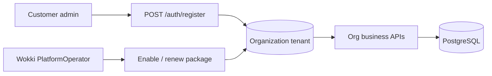

`Organization` is the tenant root. Register creates the org and Org Admin, but the org starts without an activated package. Wokki admin activates or renews the org before org users can log in/use org APIs.

### 1.0 Org package gate

```mermaid
sequenceDiagram
    participant C as Customer admin
    participant API as Auth API
    participant P as PlatformOperator
    participant PA as Platform API

    C->>API: POST /auth/register
    API-->>C: Org Admin JWT; package NotActivated
    C->>API: POST /auth/login
    API-->>C: 403 ORG_PACKAGE_NOT_ACTIVATED
    P->>PA: PUT /platform/organizations/{id}/subscription { enabled: true, durationDays }
    PA-->>P: subscriptionStatus Active + expiresAt
    C->>API: POST /auth/login
    API-->>C: accessToken + refreshToken
```

Expired org packages return `ORG_PACKAGE_EXPIRED` (402) on login/refresh and authenticated org API calls. Disabled or not-yet-activated packages return `ORG_PACKAGE_NOT_ACTIVATED` (403).

---

## 1.1 Branch workspace access

Org Admin **tạo nhân viên** (email + phòng ban) → hệ thống tự gán **Active** `LocationMembership` tại chi nhánh của phòng ban. Nhân viên **đăng nhập trực tiếp** vào app — **không** có luồng `/join` hay duyệt yêu cầu tham gia.

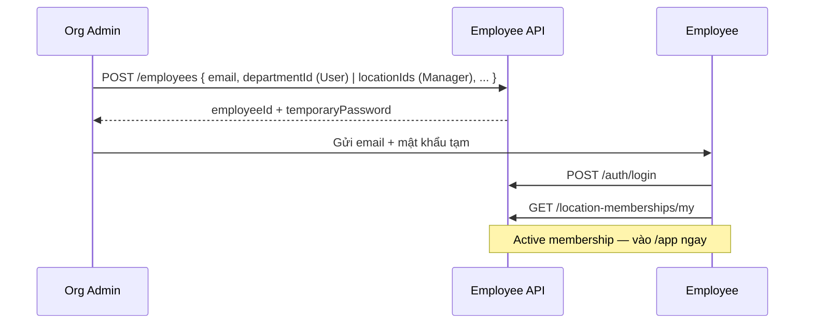

Đổi chi nhánh sau này: Admin/Manager dùng `POST /api/v1/workspace/location/transfer`. Admin quản mọi chi nhánh trong org; Manager chỉ scope `LocationManager`. Chuyển phòng ban (`/workspace/department/transfer`) chỉ hợp lệ trong chi nhánh Active hiện tại của nhân viên; đổi chi nhánh trước nếu phòng ban đích thuộc chi nhánh khác.

---

## 2. Schedule lifecycle (MVP)

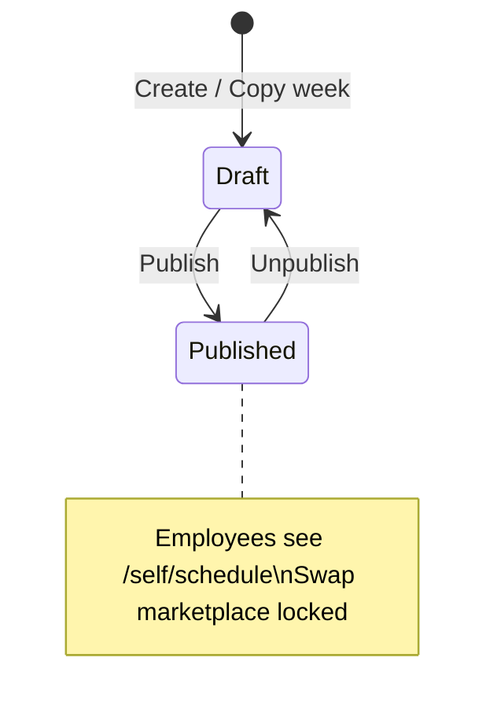

`ScheduleStatus.Locked` exists in code but **no API sets it yet** (future: lock after payroll close).

### Publish flow

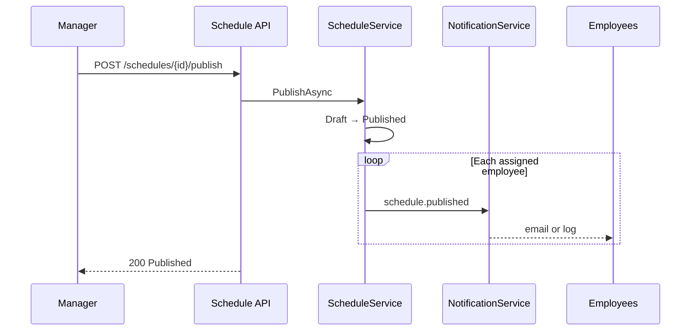

### Schedule preference flow (Draft week)

Employee **preferences** are advisory; official work schedule = `ShiftAssignment` after Admin publish.

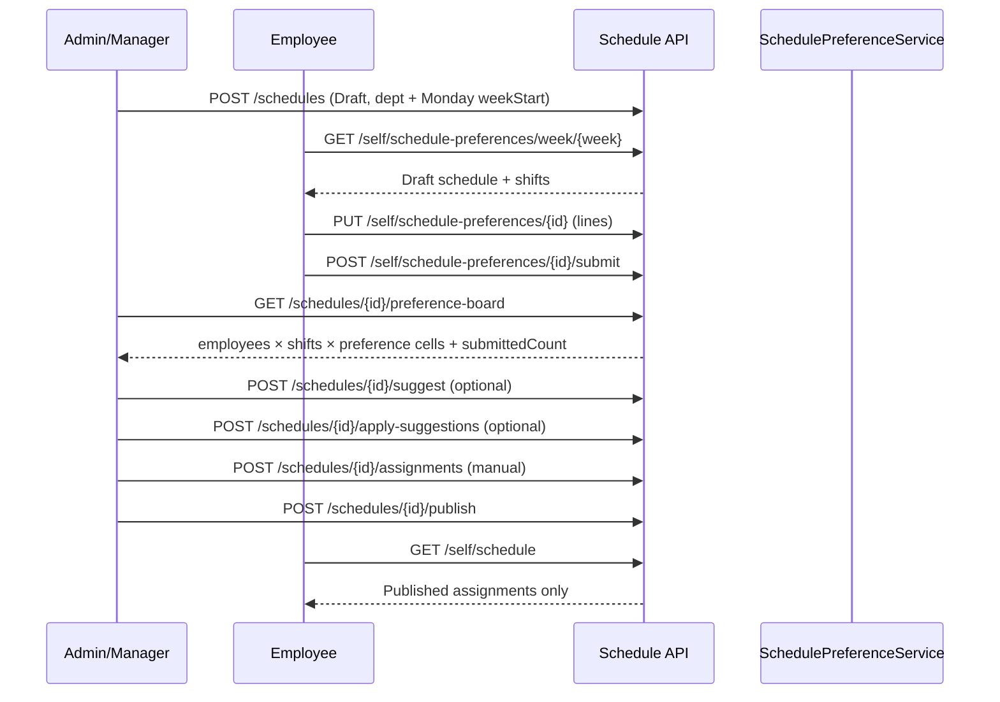

**UI mapping:** Admin **Lịch ca** — stepper + **Bảng đăng ký ca** + **Công bố lịch**. Employee **Lịch của tôi → Đăng ký ca** — click cells → **Lưu nháp** → **Gửi đăng ký**; published week → read-only preferences, official schedule on **Lịch đã công bố**.

---

## 3. Assignment creation

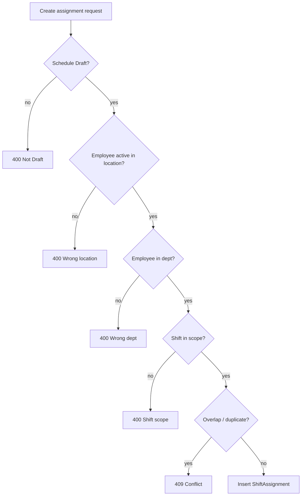

Shared validator: `ScheduleService.TryPrepareAssignmentAsync` (manual assign + apply-suggestions).

---

## 4. Shift swap marketplace (Draft)

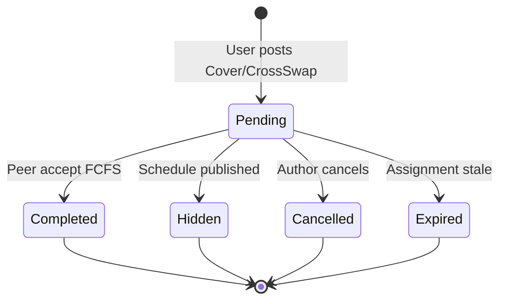

### Accept (atomic, FCFS)

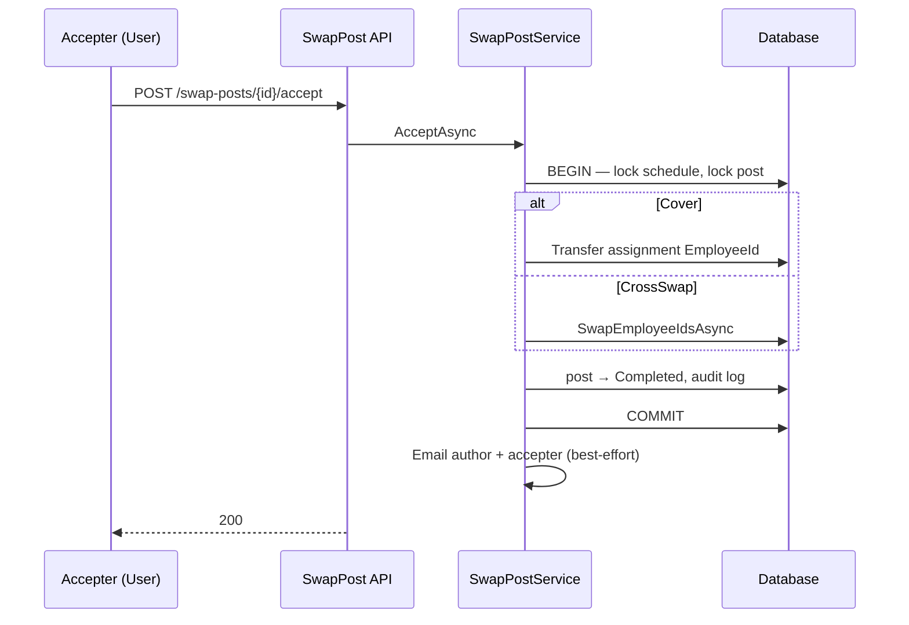

Publish uses the same schedule row lock and hides Pending posts before setting `Published`.

---

## 5. Attendance

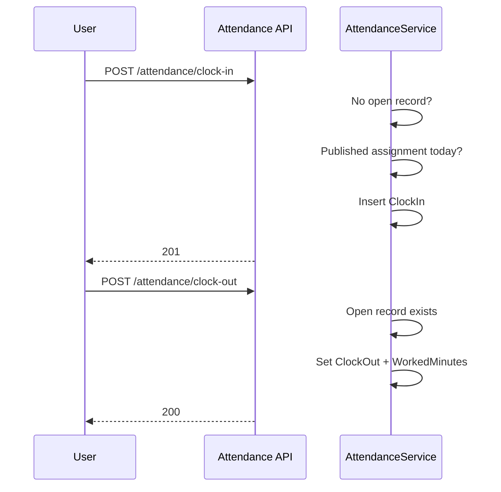

### Manual adjust guard

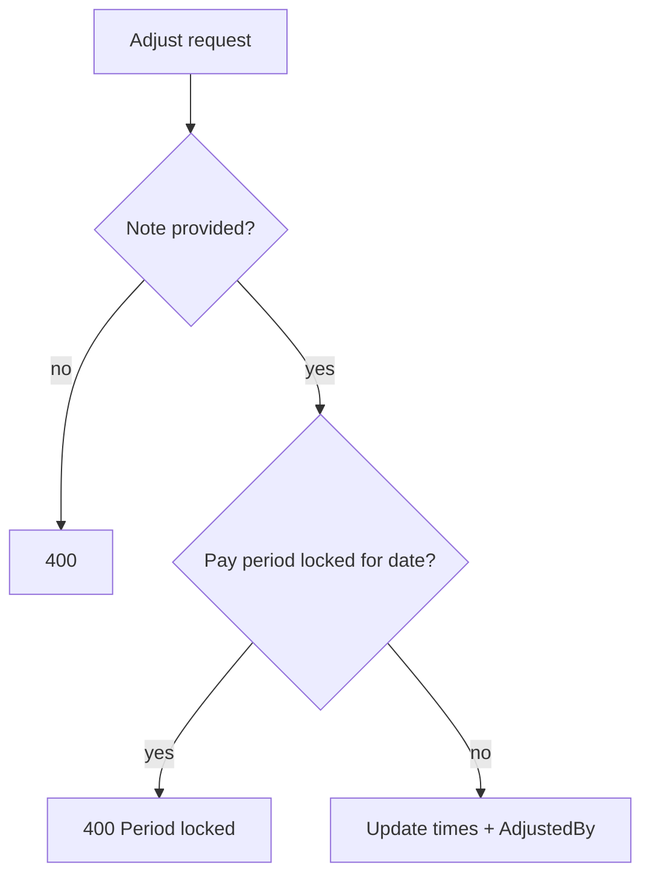

---

## 6. Payroll summary

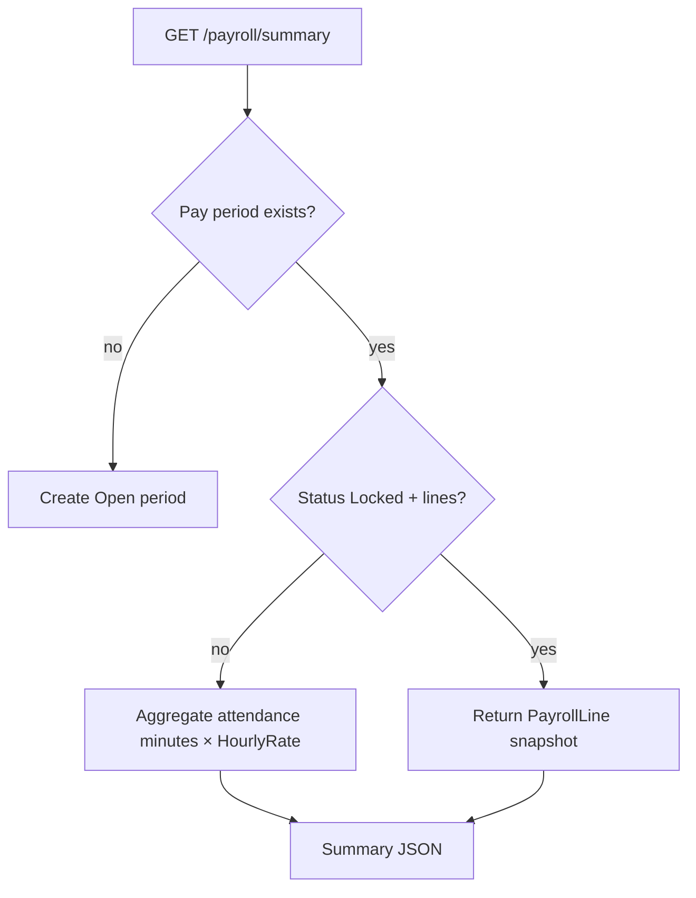

Export: `POST /payroll/summary/export` → CSV (Admin, max 500 rows).

---

## 7. Schedule suggestions (CP-SAT)

MVP solver is **CP-SAT only** (`ScheduleSuggestionOrchestrator`; `useAi` on `POST .../suggest` is **ignored**). AWS Bedrock is **advisory chat only** (BR-077) — never mutates assignments.

### Inputs (`ScheduleSuggestionContextLoader`)

| Input | Source |
|-------|--------|
| Org scheduling policy | `OrganizationSchedulingPolicy` → `OrganizationSchedulingSolverPolicy` |
| Department employees | Active branch membership + department membership |
| Active shifts | `ShiftDefinition` for schedule department |
| Submitted preferences | `SchedulePreferenceSubmission` status **Submitted** only |
| Existing assignments | Current `ShiftAssignment` rows (locked slots on re-suggest) |
| Availabilities | `EmployeeAvailability` |
| History | Published assignments, last 4 weeks |

### Suggest → context → apply → publish

```mermaid
sequenceDiagram
    participant M as Admin/Manager
    participant API as Schedule API
    participant L as ScheduleSuggestionContextLoader
    participant C as CpSatScheduleSuggestionService
    participant I as ScheduleInsightService

    M->>API: POST /schedules/{id}/suggest
    API->>L: Load org policy, employees, shifts, submitted prefs, assignments, history
    L->>C: GenerateAsync (read-only)
    C-->>API: Suggestions DTO + reason
    API->>I: GenerateContextAsync (JSON snapshot, no Bedrock)
    API-->>M: 200 suggestions only — no DB assignment write

    M->>API: POST /schedules/{id}/apply-suggestions
    API->>API: Validate rows by (shift, employee, date), one transaction
    API-->>M: 201 ShiftAssignment rows (Draft)

    M->>API: POST /schedules/{id}/publish
    API-->>M: Published schedule; preferences read-only
```

**No auto-apply, no auto-rebalance** when preferences change after apply (BR-086). Admin uses the same **Tạo gợi ý AI** button to re-suggest; CP-SAT unlocks only employees whose own submitted preferences changed or whose assignment conflicts with Unavailable. Applying suggestions is keyed by exact `(shiftDefinitionId, employeeId, date)`, so multiple employees can stay on the same shift/date when policy allows; omitted assignments are removed only for affected employees when the request explicitly clears orphan assignment tuples.

### Draft leave request (before publish)

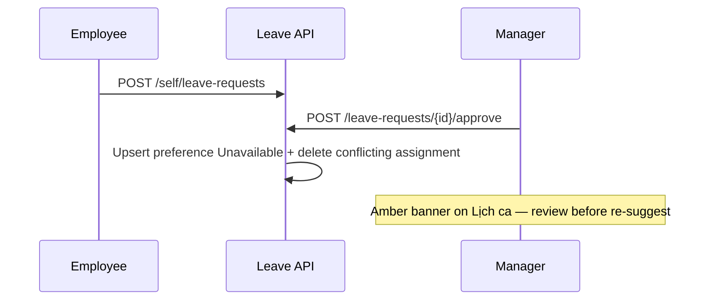

See BR-087. Not available after publish.

### Schedule insight assistant (Bedrock advisory)

```mermaid
sequenceDiagram
    participant M as Manager
    participant API as Schedule API
    participant I as ScheduleInsightService
    participant B as AWS Bedrock

    M->>API: POST /schedules/{id}/suggest
    API->>I: GenerateContextAsync after successful suggestions
    I->>I: Serialize rules, preferences, assignments, suggestions, summaries
    API-->>M: 200 suggestions; context is refreshed in DB

    M->>API: POST /schedules/{id}/insights/chat
    API->>I: ChatAsync(question)
    I->>B: Converse with context snapshot
    B-->>I: Advisory explanation
    API-->>M: 200 answer
```

Bedrock is not part of schedule generation or apply. If Bedrock is unavailable, `suggest` and `apply-suggestions` still work; only the chat endpoint fails independently.

---

## 8. Chat

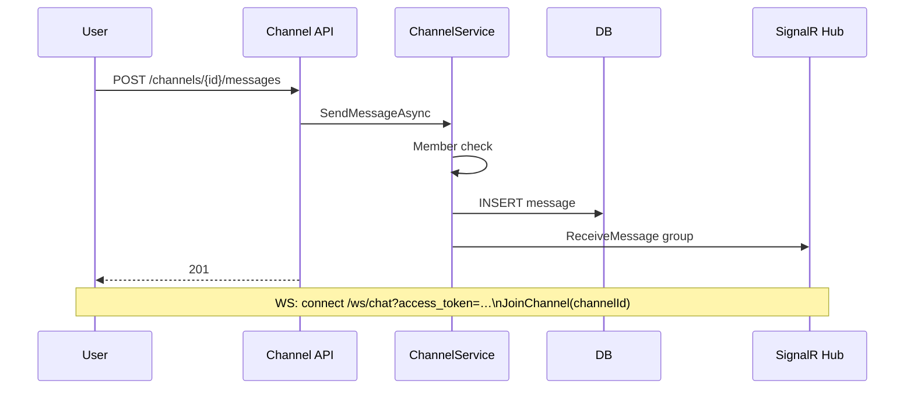

---

## 9. Agent decision tree (where to implement)

| Change type                    | Layer                                                 |
| ------------------------------ | ----------------------------------------------------- |
| New business rule / validation | `Wokki.Application` service                           |
| New HTTP route                 | `Wokki.Api/Apis/{Feature}/*Endpoints.cs`              |
| New persistence query          | `Wokki.Domain` repo interface + `Infrastructure` impl |
| New user-visible message       | `AppMessages` + service return                        |
| New enum state                 | `Wokki.Domain.Enums` + service transitions            |

Never add EF or business rules in `Wokki.Api` handlers.
