# Process Flows

Visual reference for agents. Rule IDs refer to [business-rules.md](./business-rules.md).

---

## 1. Deployment & tenancy

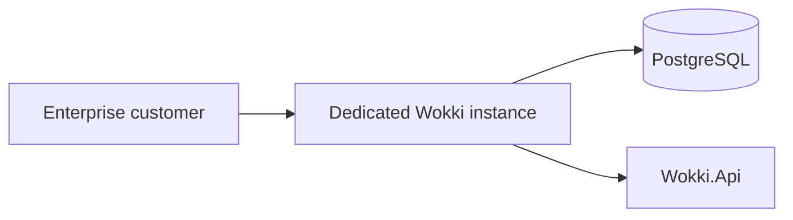

One company per environment. No shared multi-tenant database in MVP.

---

## 2. Schedule lifecycle (MVP)

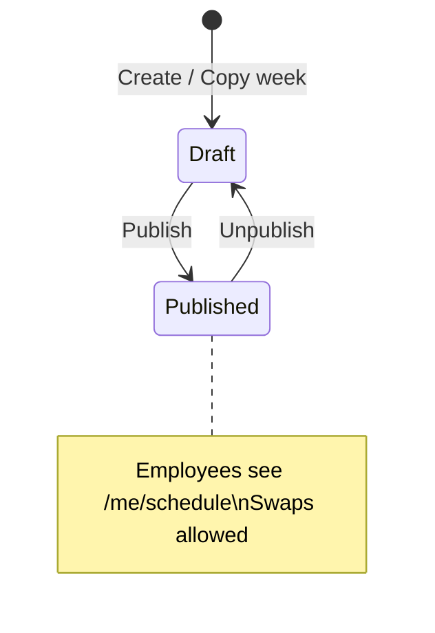

`ScheduleStatus.Locked` exists in code but **no API sets it yet** (future: lock after payroll close).

### Publish flow

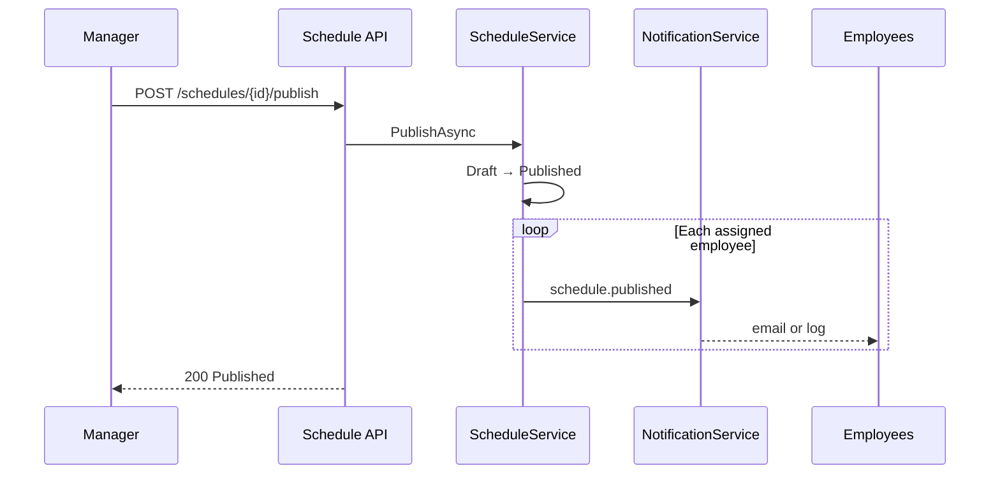

---

## 3. Assignment creation

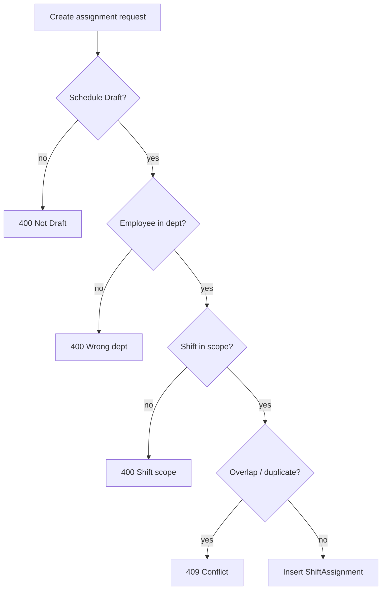

Shared validator: `ScheduleService.TryPrepareAssignmentAsync` (manual assign + apply-suggestions).

---

## 4. Shift swap

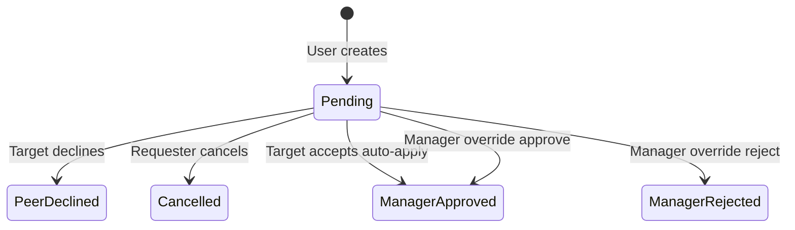

### Peer accept (atomic)

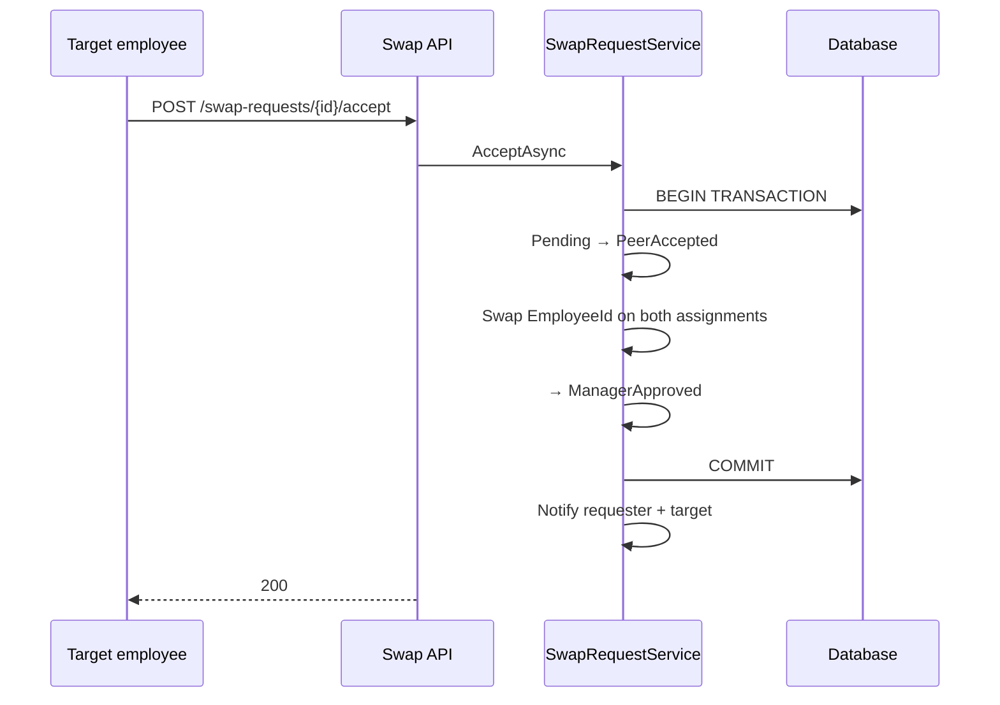

**BR-034** cutoff uses assignment `Date` and `Location.TimeZone`.

---

## 5. Attendance

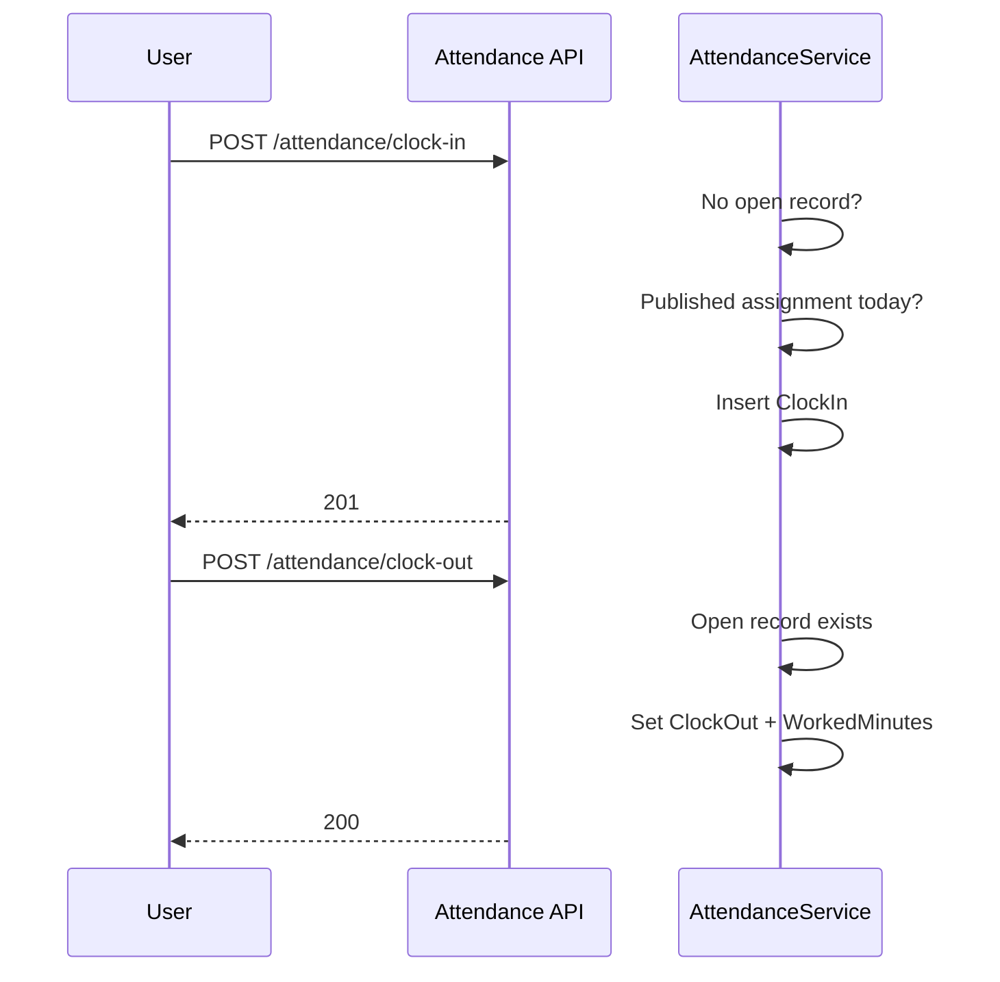

### Manual adjust guard

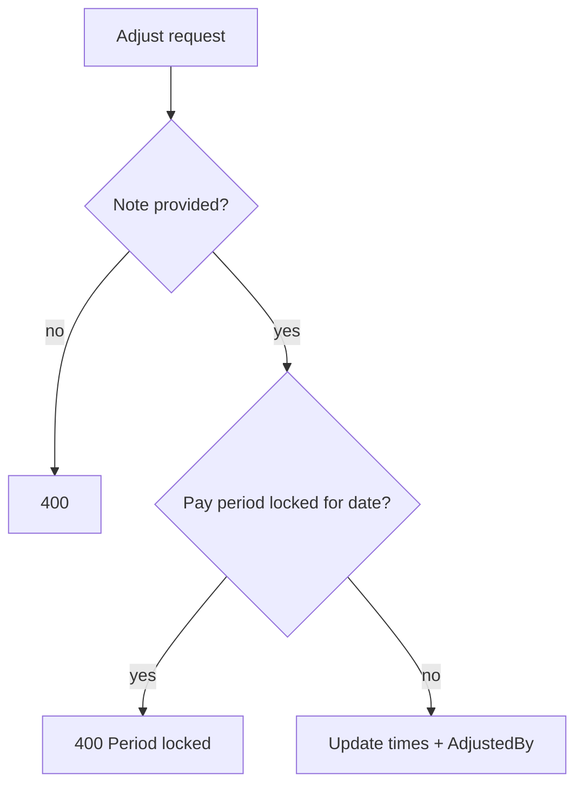

---

## 6. Payroll summary

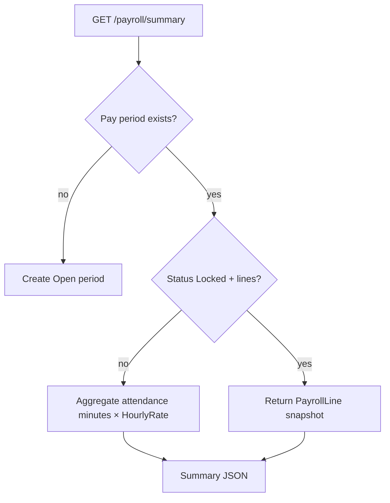

Export: `POST /payroll/summary/export` → CSV (Admin, max 500 rows).

---

## 7. Schedule suggestions (heuristic)

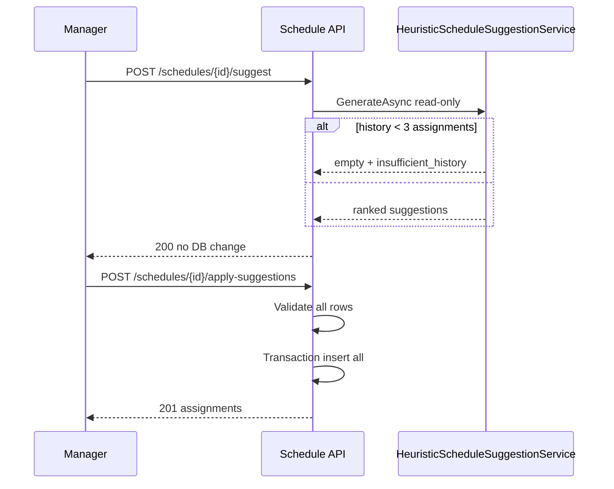

---

## 8. Chat

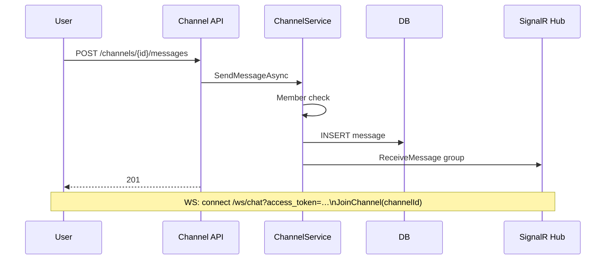

---

## 9. Agent decision tree (where to implement)

| Change type | Layer |
|-------------|--------|
| New business rule / validation | `Wokki.Application` service |
| New HTTP route | `Wokki.Api/Apis/{Feature}/*Endpoints.cs` |
| New persistence query | `Wokki.Domain` repo interface + `Infrastructure` impl |
| New user-visible message | `AppMessages` + service return |
| New enum state | `Wokki.Domain.Enums` + service transitions |

Never add EF or business rules in `Wokki.Api` handlers.
