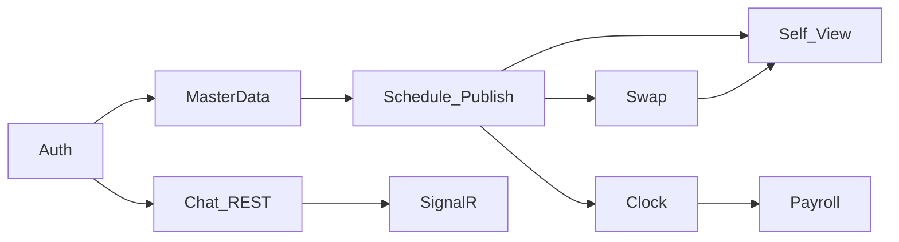

# Hướng dẫn tích hợp API — Frontend

Tài liệu bàn giao cho team FE tích hợp **Wokki Shift Ops MVP**. Chi tiết từng endpoint: [api-catalog.md](./api-catalog.md). Luồng nghiệp vụ: [process-flows.md](./process-flows.md).

**OpenAPI / thử API:** `http://localhost:8386/scalar` (Development hoặc `ApiDocs:Enabled`).

**Smoke BE (không unit test):** `plans/fe-handoff-flow-verification/run-smoke.sh`

---

## 1. Xác thực

- Login: `POST /api/v1/auth/login` → `{ accessToken, refreshToken }`
- Header mọi request bảo vệ: `Authorization: Bearer {accessToken}`
- Refresh: `POST /api/v1/auth/refresh-token` body `{ refreshToken }`
- Profile đăng nhập: `GET /api/v1/auth/me` (User entity — email, role)

**Seed dev:** [README.md](../../README.md#default-seed-users)

| Role | Email | Password |
|------|-------|----------|
| Admin | admin@gmail.com | 12345@Abc |
| Manager | manager@gmail.com | 12345@Abc |
| User | user@gmail.com | 12345@Abc |

---

## 2. Envelope phản hồi

```json
{
  "success": true,
  "data": { },
  "message": { "code": "AUTH_LOGIN_SUCCESS", "text": "...", "statusCode": 200 },
  "errors": null
}
```

- Luôn kiểm tra `success` trước khi đọc `data`.
- Lỗi validation: `errors[]` với `field` + `message`.
- Mã nghiệp vụ: `message.code` (ví dụ `SWAP_CUTOFF`, `SCHEDULE_NOT_DRAFT`) — tham chiếu `Wokki.Common.Utils.AppMessages`.

---

## 3. Hai nhóm “của tôi” — không nhầm

| Nhu cầu UI | API |
|------------|-----|
| Thông tin tài khoản (email, role) | `GET /api/v1/auth/me` |
| Lịch ca / đổi ca / chấm công (nghiệp vụ nhân viên) | `GET /api/v1/self/*` |

`/self/*` yêu cầu user có bản ghi **Employee** liên kết (seed: `user@gmail.com`).

---

## 4. Bảy luồng chính (main flows)



### F0 — Auth & phiên

Login → lưu token → `auth/me` → refresh khi 401 (tuỳ FE policy).

### F0b — Dữ liệu gốc (Admin/Manager)

`/employees`, `/locations`, `/departments`, `/shifts` — thiết lập trước khi tạo lịch.

### F1 — Lịch (Manager/Admin)

1. `POST /schedules` (Draft, `weekStartDate` = thứ Hai)
2. `POST /schedules/{id}/assignments`
3. `POST /schedules/{id}/publish`
4. (Tùy chọn) `POST .../suggest` → `POST .../apply-suggestions`

**User không gọi** `/schedules/*` (BR-002).

### F2 — Nhân viên xem ca

`GET /api/v1/self/schedule` — 28 ngày tới, lịch Published.

### F3 — Đổi ca

1. User `POST /swap-requests`
2. Đối tác `POST /swap-requests/{id}/accept` | `decline`
3. Manager `override-approve` | `override-reject` khi cần
4. `GET /self/swap-requests` — danh sách gửi/nhận

### F4 — Chấm công

- User: `POST /attendance/clock-in`, `clock-out` (rate limit **Clock**)
- `GET /self/attendance`
- Manager: `GET /attendance`, `PUT /attendance/{id}/adjust` (bắt buộc ghi chú)

**Điều kiện clock-in:** Có phân ca Published **hôm nay**.

### F5 — Lương

- Manager: `GET /payroll/summary?departmentId&startDate&endDate`
- Admin: `POST /payroll/summary/export` → CSV

### F6 — Chat

- REST: `/api/v1/channels`, messages `{"body":"..."}`
- SignalR: `ws://{host}/ws/chat?access_token={jwt}`
  - Client: `JoinChannel(channelId)`, `LeaveChannel(channelId)`
  - Server: `ReceiveMessage`

`ChannelType`: `0` = Direct, `1` = Group.

---

## 5. Gợi ý map màn hình FE

| Màn hình | Role | API chính |
|----------|------|-----------|
| Login | All | `auth/login`, `auth/me` |
| Admin users | Admin | `users/*` |
| Master data | Admin, Manager | `employees`, `locations`, `departments`, `shifts` |
| Lịch tuần | Manager | `schedules/*`, `shifts` |
| Ca của tôi | User | `self/schedule`, `self/swap-requests` |
| Đổi ca | User | `swap-requests/*` |
| Chấm công | User | `attendance/clock-*`, `self/attendance` |
| Duyệt chấm công | Manager | `attendance`, `attendance/{id}/adjust` |
| Payroll | Manager, Admin | `payroll/summary`, export |
| Chat | All (có Employee) | `channels/*` + SignalR |

---

## 6. Rate limiting

| Policy | Áp dụng | Giới hạn (mặc định) |
|--------|---------|---------------------|
| `Fixed` | Hầu hết `/api/v1/*` | 100/phút |
| `Clock` | `clock-in`, `clock-out` | 300/phút |

Xử lý HTTP 429 trên FE (retry/backoff).

---

## 7. Gap MVP (không implement FE cho đến khi BE có API)

- Trạng thái lịch **Locked** — chưa có endpoint
- **Khóa kỳ lương** — chưa có API lock (chỉ đọc `Locked` trong service)
- Gợi ý heuristic có thể trả danh sách rỗng

Chi tiết: [plans/fe-handoff-flow-verification/gaps.md](../../plans/fe-handoff-flow-verification/gaps.md)

---

## 8. Tài liệu liên quan

| File | Mục đích |
|------|----------|
| [flow-matrix.md](../../plans/fe-handoff-flow-verification/flow-matrix.md) | Thứ tự API + BR |
| [manual-smoke-runbook.md](../../plans/fe-handoff-flow-verification/manual-smoke-runbook.md) | Kiểm tra thủ công |
| [business-rules.md](./business-rules.md) | Quy tắc BR-xxx |
| [brd.md](./brd.md) | Phạm vi sản phẩm |
