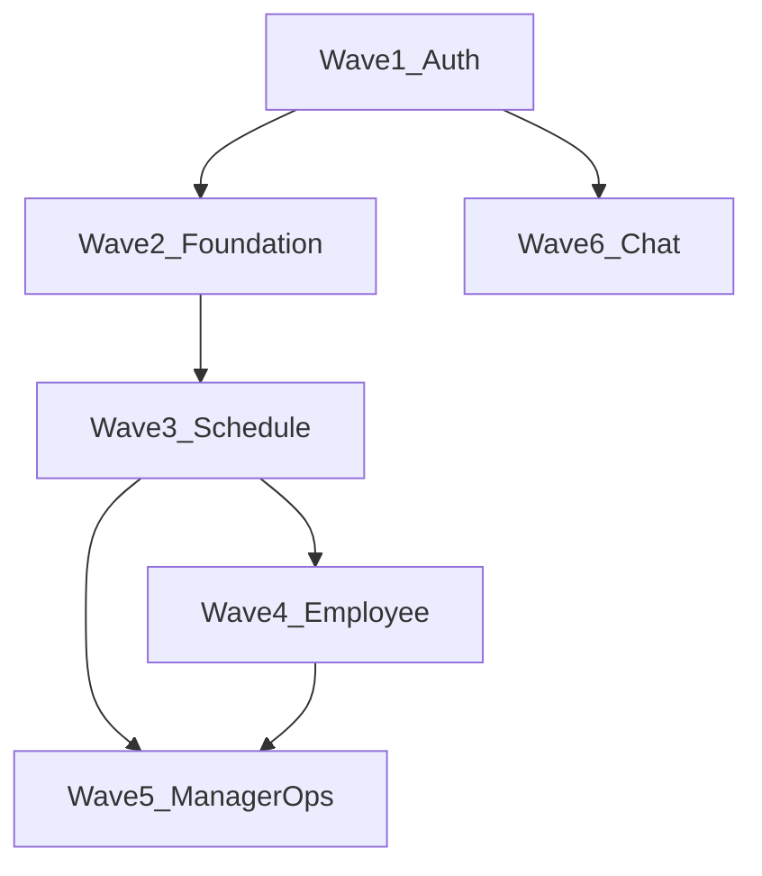

# Hướng dẫn tích hợp API — Frontend

Tài liệu bàn giao cho team FE tích hợp **Wokki Shift Ops MVP**. Chi tiết từng endpoint: [api-catalog.md](./api-catalog.md). Luồng nghiệp vụ: [process-flows.md](./process-flows.md).

**OpenAPI / thử API:** `http://localhost:8386/scalar` (Development hoặc `ApiDocs:Enabled`).

**Smoke BE (không unit test):** `plans/fe-handoff-flow-verification/run-smoke.sh`

**Handoff theo wave (contract từng file):** [docs/fe/README.md](../fe/README.md)

---

## 1. Xác thực

- Login: `POST /api/v1/auth/login` → `{ accessToken, refreshToken }`
- Header mọi request bảo vệ: `Authorization: Bearer {accessToken}`
- Refresh: `POST /api/v1/auth/refresh-token` body `{ refreshToken }`
- Profile đăng nhập: `GET /api/v1/auth/me` (User entity — email, role)

**Seed dev:** [README.md](../../README.md#default-seed-users)

| Role | Email | Password |
|------|-------|----------|
| Admin | admin@gmail.com | 12345@Abc |
| Manager | manager@gmail.com | 12345@Abc |
| User | user@gmail.com | 12345@Abc |

---

## 2. Envelope phản hồi

```json
{
  "success": true,
  "data": { },
  "message": { "code": "AUTH_LOGIN_SUCCESS", "text": "...", "statusCode": 200 },
  "errors": null
}
```

- Luôn kiểm tra `success` trước khi đọc `data`.
- Lỗi validation: `errors[]` với `field` + `message`.
- Mã nghiệp vụ: `message.code` (ví dụ `SWAP_CUTOFF`, `SCHEDULE_NOT_DRAFT`) — tham chiếu `Wokki.Common.Utils.AppMessages`.

---

## 3. Hai nhóm “của tôi” — không nhầm

| Nhu cầu UI | API |
|------------|-----|
| Thông tin tài khoản (email, role) | `GET /api/v1/auth/me` |
| Lịch ca / đổi ca / chấm công (nghiệp vụ nhân viên) | `GET /api/v1/self/*` |

`/self/*` yêu cầu user có bản ghi **Employee** liên kết (seed: `user@gmail.com`).

---

## 4. Thứ tự triển khai FE (tránh conflict)

FE nên làm **theo đúng thứ tự dưới đây**. Luồng sau phụ thuộc dữ liệu/id từ luồng trước; gọi sớm sẽ gặp 400/404/409 hoặc màn hình trống.



| Wave | Ai build trước | Phụ thuộc |
|------|----------------|-----------|
| **1** | Mọi màn hình | Token JWT |
| **2** | Admin / setup | Location → Department → Employee → Shift |
| **3** | Manager lịch | Có `departmentId`, `shiftDefinitionId` |
| **4** | App nhân viên | Lịch **Published** + phân ca |
| **5** | Manager vận hành | Có attendance / swap |
| **6** | Chat (song song được sau Wave 1) | User có Employee |

**Quy tắc tránh conflict**

- **User** không gọi `/api/v1/schedules/*` (chỉ Manager/Admin).
- **`GET /auth/me`** ≠ **`GET /self/*`** (tài khoản vs nghiệp vụ nhân viên).
- **Đổi ca / chấm công** chỉ sau khi có lịch **Published** và phân ca.
- **Payroll** chỉ meaningful sau **clock-out** (có `workedMinutes`).
- Sau **swap accept**, gọi lại `GET /self/schedule` để UI khớp DB.

---

### Wave 1 — Auth (làm trước tiên)

| Bước | API | Method | Body / query | Lưu `id` |
|------|-----|--------|--------------|----------|
| 1 | `/api/v1/auth/login` | POST | `{ email, password }` | `accessToken`, `refreshToken` |
| 2 | `/api/v1/auth/me` | GET | Bearer | `userId`, `role` → route guard |
| 3 | `/api/v1/auth/refresh-token` | POST | `{ refreshToken }` | token mới khi 401 |
| 4 | `/api/v1/auth/logout` | POST | Bearer | (tuỳ chọn) |
| 5 | `/health` | GET | — | kiểm tra API sống |

**Không** dùng `/self/*` ở wave này.

---

### Wave 2 — Dữ liệu gốc (Admin / Manager setup)

Thứ tự **trong wave** (tránh FK sai):

| Bước | API | Method | Ghi chú |
|------|-----|--------|---------|
| 1 | `/api/v1/locations` | GET | Danh sách (seed đã có Main Office) |
| 2 | `/api/v1/locations` | POST | Tạo mới nếu cần → lưu `locationId` |
| 3 | `/api/v1/departments` | GET | Theo location |
| 4 | `/api/v1/departments` | POST | `{ locationId, name }` → `departmentId` |
| 5 | `/api/v1/employees` | GET | |
| 6 | `/api/v1/employees` | POST | Gắn `departmentId`, `userId` → `employeeId` |
| 7 | `/api/v1/shifts` | GET | |
| 8 | `/api/v1/shifts` | POST | `{ locationId, departmentId?, name, startTime, endTime, requiredRole }` → `shiftDefinitionId` |

**Admin thêm (song song wave 2):**

| API | Method |
|-----|--------|
| `/api/v1/users` | GET, POST |
| `/api/v1/users/{id}` | GET |

---

### Wave 3 — Lịch tuần (Manager / Admin) — bắt buộc trước nhân viên

| Bước | API | Method | Body / query | Điều kiện |
|------|-----|--------|--------------|-----------|
| 1 | `/api/v1/schedules` | GET | `?departmentId=&weekStartDate=&page=` | Xem lịch tuần |
| 2 | `/api/v1/schedules` | POST | `{ departmentId, weekStartDate }` (thứ Hai) | Tạo Draft → `scheduleId` |
| 3 | `/api/v1/schedules/{scheduleId}` | GET | — | Chi tiết + `assignments[]` |
| 4 | `/api/v1/schedules/{scheduleId}/assignments` | POST | `{ shiftDefinitionId, employeeId, date, note? }` | **Chỉ Draft**; lặp cho từng ca → `assignmentId` |
| 5 | `/api/v1/schedules/{scheduleId}/assignments/{assignmentId}` | DELETE | — | Xóa phân ca (Draft) |
| 6 | `/api/v1/schedules/{scheduleId}/suggest` | POST | body gợi ý (tuỳ chọn) | Không ghi DB |
| 7 | `/api/v1/schedules/{scheduleId}/apply-suggestions` | POST | danh sách gợi ý | **Chỉ Draft** |
| 8 | `/api/v1/schedules/{scheduleId}/publish` | POST | `{}` | Draft → **Published** — mở wave 4 |
| 9 | `/api/v1/schedules/{scheduleId}/unpublish` | POST | — | Published → Draft (sửa lại) |
| 10 | `/api/v1/schedules/{scheduleId}/copy` | POST | tuần đích | Copy sang Draft mới |

**Sau bước 8** nhân viên mới thấy ca trên `GET /self/schedule`.

---

### Wave 4 — Nhân viên (User + có Employee)

Chỉ gọi sau **publish**. Dùng token User (`user@gmail.com` seed).

#### F2 — Xem lịch của tôi

| Bước | API | Method |
|------|-----|--------|
| 1 | `/api/v1/self/schedule` | GET |

Refresh sau swap accept.

#### F3 — Đổi ca (User)

| Bước | API | Method | Ai gọi |
|------|-----|--------|--------|
| 1 | `/api/v1/self/swap-requests` | GET | User — danh sách gửi/nhận |
| 2 | `/api/v1/swap-requests` | POST | User — `{ requesterAssignmentId, targetAssignmentId, requesterNote? }` → `swapId` |
| 3 | `/api/v1/swap-requests/{swapId}` | GET | User / Manager — chi tiết |
| 4 | `/api/v1/swap-requests/{swapId}/accept` | POST | **Đối tác** (employee nhận ca) |
| 5 | `/api/v1/swap-requests/{swapId}/decline` | POST | Đối tác |
| 6 | `/api/v1/swap-requests/{swapId}/cancel` | POST | Người gửi |
| 7 | `/api/v1/self/schedule` | GET | Cả hai — xác nhận đã đổi ca |

**Manager (wave 5, có thể gộp màn duyệt):**

| API | Method |
|-----|--------|
| `/api/v1/swap-requests` | GET — lọc `?status=&departmentId=` |
| `/api/v1/swap-requests/{swapId}/override-approve` | POST |
| `/api/v1/swap-requests/{swapId}/override-reject` | POST |

#### F4 — Chấm công (User)

Cần phân ca **Published** trùng **ngày hôm nay**.

| Bước | API | Method | Rate |
|------|-----|--------|------|
| 1 | `/api/v1/attendance/clock-in` | POST | Clock |
| 2 | `/api/v1/attendance/clock-out` | POST | Clock |
| 3 | `/api/v1/self/attendance` | GET | `?fromDate=&toDate=` |

---

### Wave 5 — Manager / Admin vận hành (sau wave 3–4)

#### F4b — Duyệt / sửa chấm công

| Bước | API | Method |
|------|-----|--------|
| 1 | `/api/v1/attendance` | GET — lọc theo ngày/nhân viên |
| 2 | `/api/v1/attendance/{attendanceId}/adjust` | PUT — **bắt buộc** ghi chú điều chỉnh |

#### F5 — Lương

| Bước | API | Method | Query |
|------|-----|--------|-------|
| 1 | `/api/v1/payroll/summary` | GET | `departmentId`, `startDate`, `endDate` |
| 2 | `/api/v1/payroll/summary/{employeeId}` | GET | cùng query |
| 3 | `/api/v1/payroll/summary/export` | POST | Admin — CSV (cùng tham số kỳ) |

Gọi sau khi đã có bản ghi clock-out trong kỳ.

---

### Wave 6 — Chat (sau Wave 1; cần Employee)

| Bước | API / transport | Method | Ghi chú |
|------|-----------------|--------|---------|
| 1 | `/api/v1/channels` | GET | Kênh của mình |
| 2 | `/api/v1/channels` | POST | Manager/Admin — `{ type: 0\|1, name?, memberEmployeeIds[] }` |
| 3 | `/api/v1/channels/{channelId}/messages` | GET | `?before=&limit=` |
| 4 | `/api/v1/channels/{channelId}/messages` | POST | `{ body }` |
| 5 | `/api/v1/channels/{channelId}/messages/{messageId}` | DELETE | Người gửi / Admin |
| 6 | `ws://{host}/ws/chat?access_token={jwt}` | SignalR | `JoinChannel(channelId)` → nhận `ReceiveMessage` |

`type`: `0` = Direct, `1` = Group.

---

### Một vòng “happy path” đủ 7 flow (test tích hợp)

Dùng để QA end-to-end; thứ tự API **không đổi**:

1. Manager login → `POST /shifts` → `POST /schedules` → 2× `POST .../assignments` → `POST .../publish`
2. User login → `GET /self/schedule`
3. User `POST /swap-requests` → Manager/User đối tác `POST .../accept` → `GET /self/schedule` (cả hai)
4. User `POST /attendance/clock-in` → `clock-out` → `GET /self/attendance`
5. Manager `GET /attendance` → `GET /payroll/summary`
6. Manager `POST /channels` → `POST .../messages` + SignalR

Script tự động: `plans/fe-handoff-flow-verification/run-smoke.sh`

---

## 5. Gợi ý map màn hình FE

| Màn hình | Role | API chính |
|----------|------|-----------|
| Login | All | `auth/login`, `auth/me` |
| Admin users | Admin | `users/*` |
| Master data | Admin, Manager | `employees`, `locations`, `departments`, `shifts` |
| Lịch tuần | Manager | `schedules/*`, `shifts` |
| Ca của tôi | User | `self/schedule`, `self/swap-requests` |
| Đổi ca | User | `swap-requests/*` |
| Chấm công | User | `attendance/clock-*`, `self/attendance` |
| Duyệt chấm công | Manager | `attendance`, `attendance/{id}/adjust` |
| Payroll | Manager, Admin | `payroll/summary`, export |
| Chat | All (có Employee) | `channels/*` + SignalR |

---

## 6. Rate limiting

| Policy | Áp dụng | Giới hạn (mặc định) |
|--------|---------|---------------------|
| `Fixed` | Hầu hết `/api/v1/*` | 100/phút |
| `Clock` | `clock-in`, `clock-out` | 300/phút |

Xử lý HTTP 429 trên FE (retry/backoff).

---

## 7. Gap MVP (không implement FE cho đến khi BE có API)

- Trạng thái lịch **Locked** — chưa có endpoint
- **Khóa kỳ lương** — chưa có API lock (chỉ đọc `Locked` trong service)
- Gợi ý heuristic có thể trả danh sách rỗng

Chi tiết: [plans/fe-handoff-flow-verification/gaps.md](../../plans/fe-handoff-flow-verification/gaps.md)

---

## 8. Tài liệu liên quan

| File | Mục đích |
|------|----------|
| [docs/fe/README.md](../fe/README.md) | **6 file handoff theo wave** (dùng với `/ck-docs-fe`) |
| [flow-matrix.md](../../plans/fe-handoff-flow-verification/flow-matrix.md) | Thứ tự API + BR |
| [manual-smoke-runbook.md](../../plans/fe-handoff-flow-verification/manual-smoke-runbook.md) | Kiểm tra thủ công |
| [business-rules.md](./business-rules.md) | Quy tắc BR-xxx |
| [brd.md](./brd.md) | Phạm vi sản phẩm |
