# Luồng xử lý (Process Flows)

Tham chiếu cho agents. Mã quy tắc: [business-rules.md](./business-rules.md) (`BR-xxx`).

---

## 1. Triển khai & tenancy

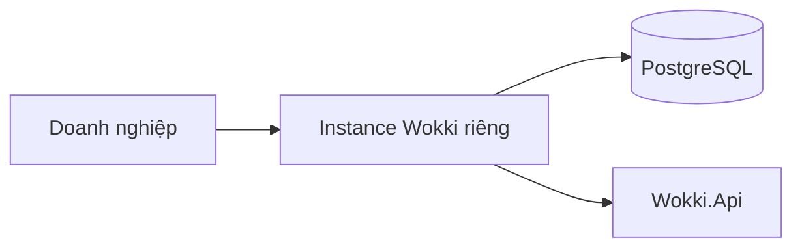

Một công ty một môi trường. Không chia sẻ database đa tenant trong MVP.

---

## 2. Vòng đời lịch (MVP)

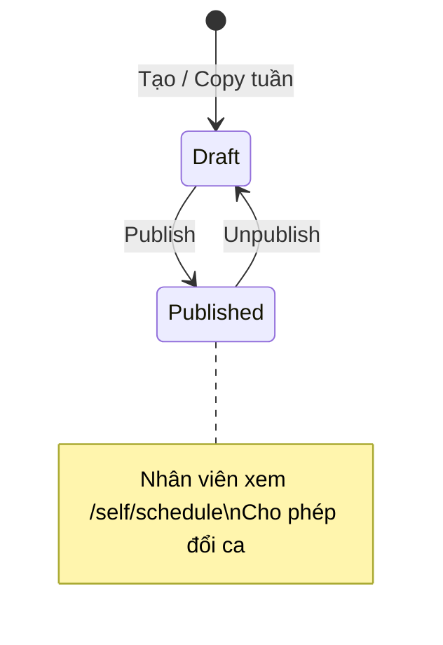

`ScheduleStatus.Locked` có trong code nhưng **chưa có API** gán trạng thái này.

### Luồng publish

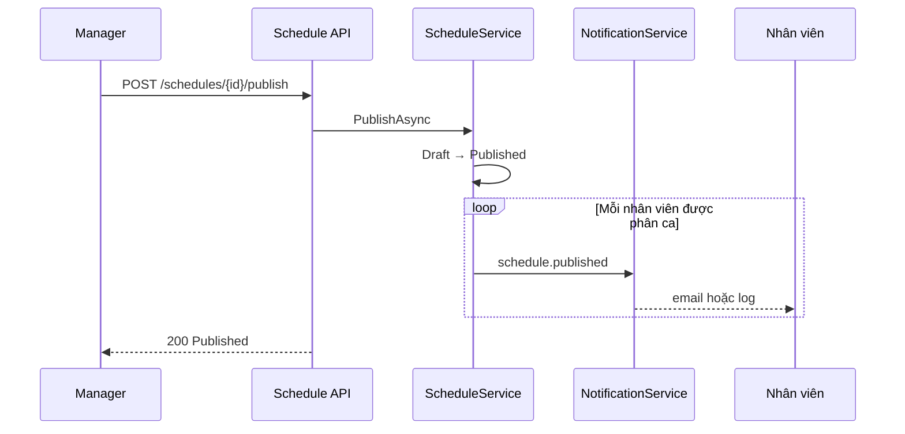

---

## 3. Tạo phân ca

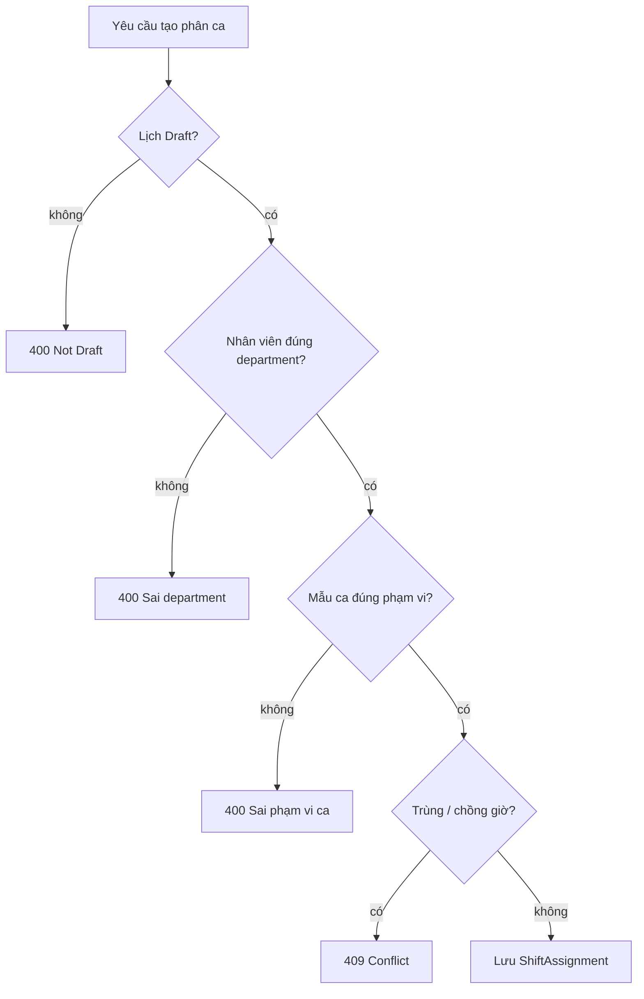

Validator dùng chung: `ScheduleService.TryPrepareAssignmentAsync` (phân ca thủ công + apply gợi ý).

---

## 4. Đổi ca (Swap)

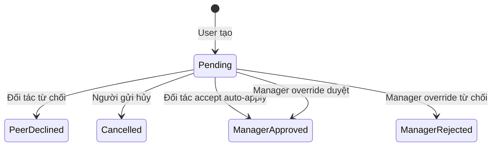

### Accept đồng nghiệp (nguyên tử)

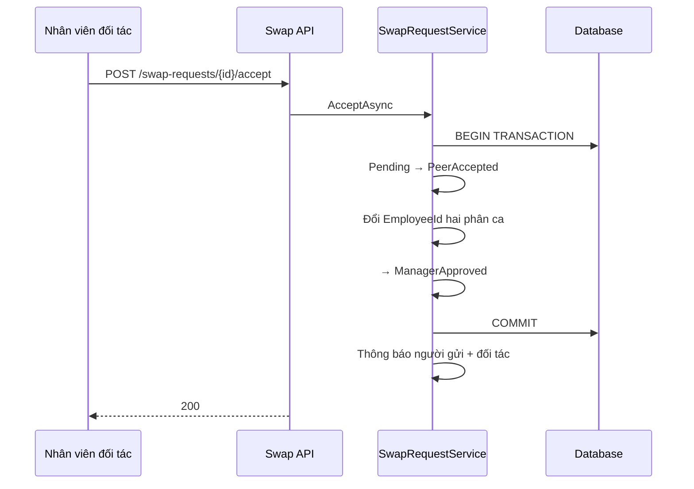

**BR-034**: cutoff theo `Date` phân ca và `Location.TimeZone`.

---

## 5. Chấm công

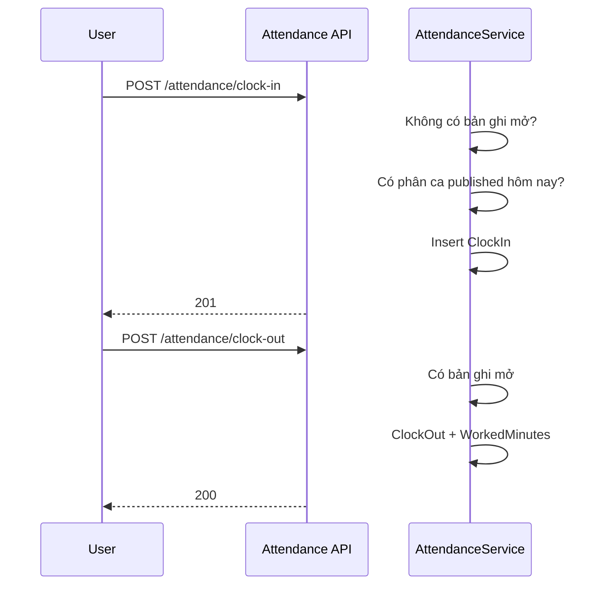

### Chặn điều chỉnh thủ công

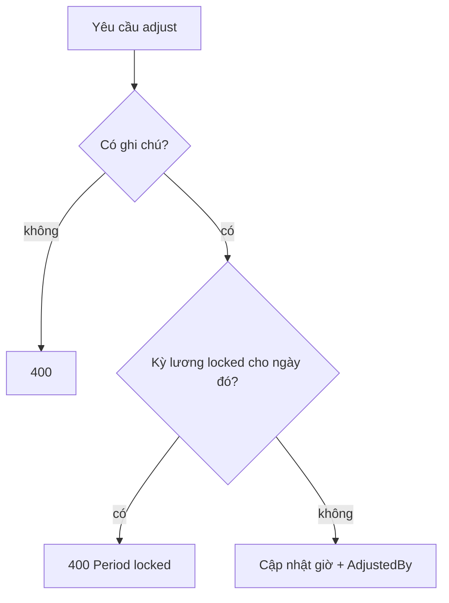

---

## 6. Tổng hợp lương

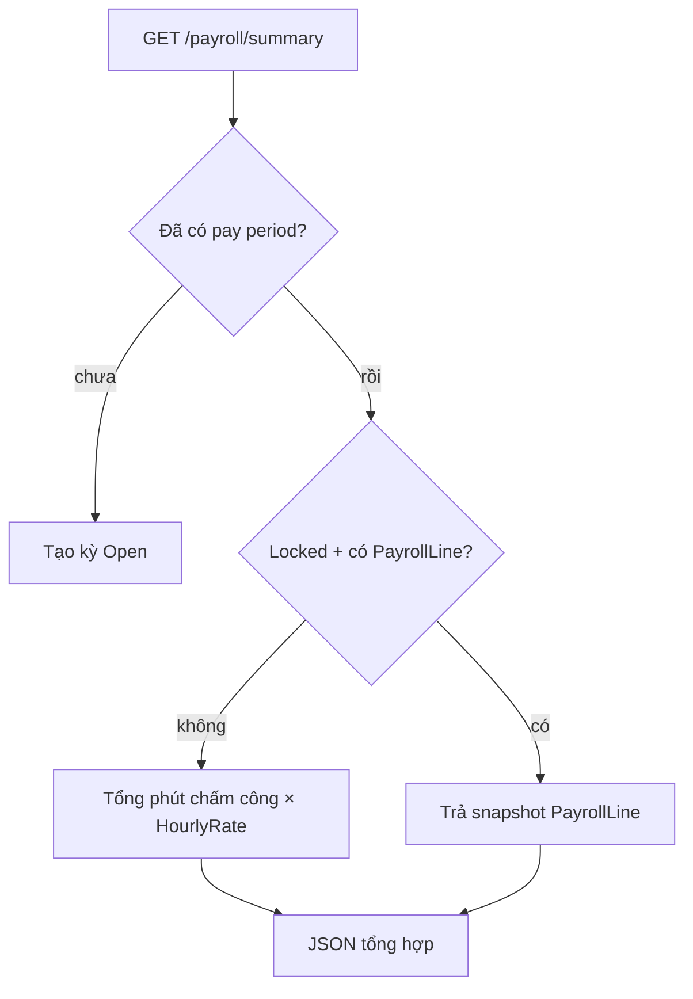

Export: `POST /payroll/summary/export` → CSV (Admin, tối đa 500 dòng).

---

## 7. Gợi ý lịch (heuristic)

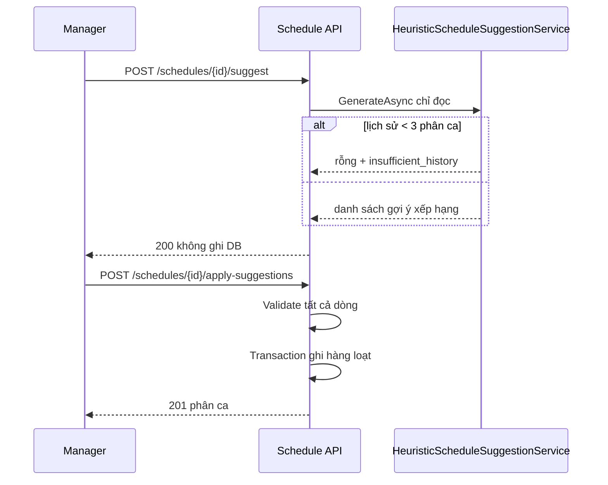

---

## 8. Chat

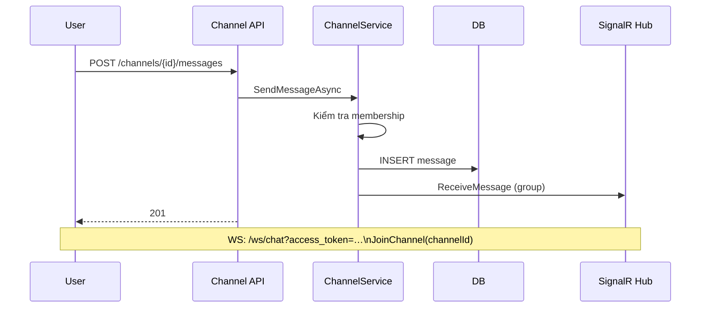

---

## 9. Cây quyết định cho agent (sửa code ở đâu)

| Loại thay đổi | Tầng |
|---------------|------|
| Quy tắc / validation mới | `Wokki.Application` service |
| Route HTTP mới | `Wokki.Api/Apis/{Feature}/*Endpoints.cs` |
| Truy vấn DB mới | Interface repo `Wokki.Domain` + impl `Infrastructure` |
| Message hiển thị | `AppMessages` + service return |
| Trạng thái enum mới | `Wokki.Domain.Enums` + chuyển trạng thái trong service |

Không đặt EF hay quy tắc nghiệp vụ trong handler `Wokki.Api`.
