# Luồng xử lý (Process Flows)

Tham chiếu cho agents. Mã quy tắc: [business-rules.md](./business-rules.md) (`BR-xxx`).

---

## 1. Triển khai & tenancy

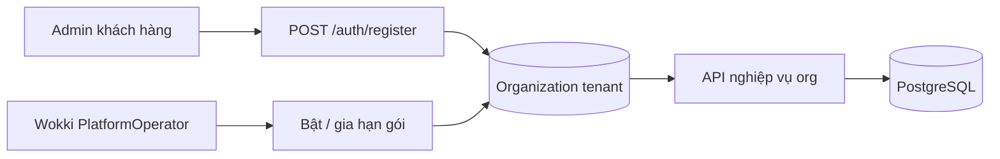

`Organization` là tenant root. Register tạo org và Org Admin, nhưng org mới mặc định chưa có gói sử dụng. Wokki admin phải kích hoạt hoặc gia hạn gói trước khi user trong org đăng nhập/dùng API nghiệp vụ.

### 1.0 Gate gói sử dụng org

```mermaid
sequenceDiagram
    participant C as Admin khách hàng
    participant API as Auth API
    participant P as PlatformOperator
    participant PA as Platform API

    C->>API: POST /auth/register
    API-->>C: JWT Org Admin; package NotActivated
    C->>API: POST /auth/login
    API-->>C: 403 ORG_PACKAGE_NOT_ACTIVATED
    P->>PA: PUT /platform/organizations/{id}/subscription { enabled: true, durationDays }
    PA-->>P: subscriptionStatus Active + expiresAt
    C->>API: POST /auth/login
    API-->>C: accessToken + refreshToken
```

Org hết hạn trả `ORG_PACKAGE_EXPIRED` (402) khi login/refresh và khi gọi API org bằng token cũ. Org chưa kích hoạt hoặc bị tắt trả `ORG_PACKAGE_NOT_ACTIVATED` (403).

---

## 1.1 Quyền truy cập workspace chi nhánh

Org Admin **tạo nhân viên** (email + phòng ban) → hệ thống tự gán **Active** `LocationMembership` tại chi nhánh của phòng ban. Nhân viên **đăng nhập trực tiếp** — **không** có `/join` hay duyệt yêu cầu tham gia.

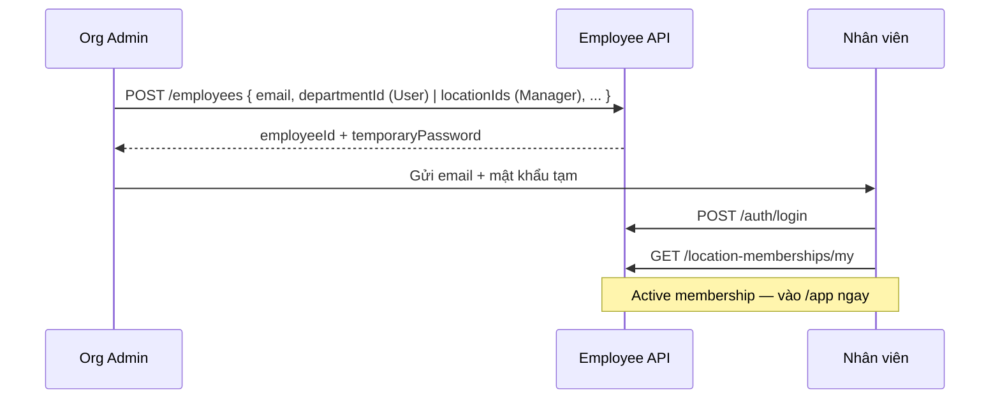

Đổi chi nhánh sau này: Admin/Manager dùng `POST /api/v1/workspace/location/transfer`. Chuyển phòng ban (`/workspace/department/transfer`) chỉ hợp lệ trong chi nhánh Active hiện tại của nhân viên; nếu phòng ban đích thuộc chi nhánh khác thì phải chuyển chi nhánh trước.

---

## 2. Vòng đời lịch (MVP)

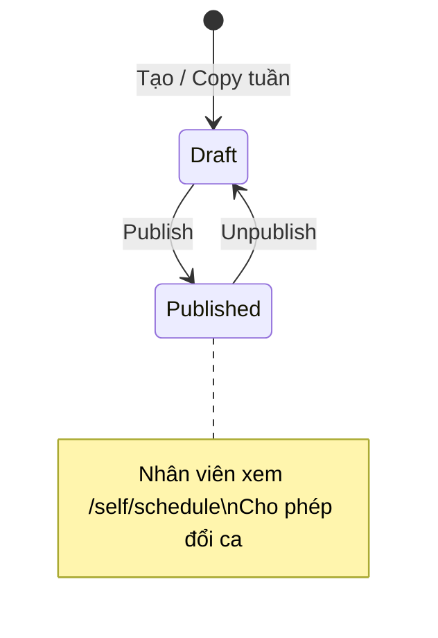

`ScheduleStatus.Locked` có trong code nhưng **chưa có API** gán trạng thái này.

### Luồng publish

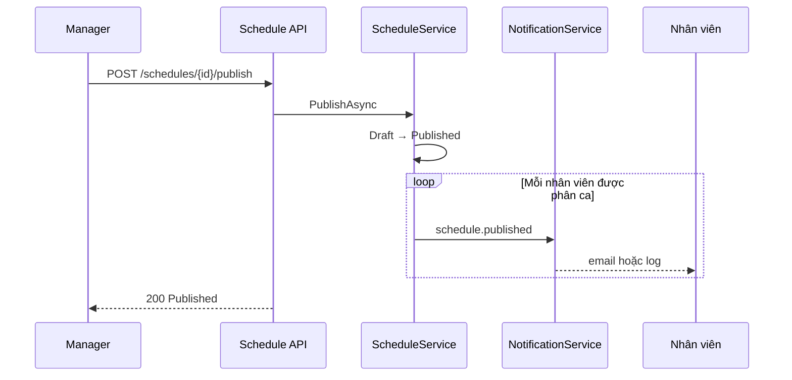

### Luồng đăng ký ca (tuần Draft)

Đăng ký ca **chỉ tham khảo**; lịch chính thức = `ShiftAssignment` sau khi Admin publish.

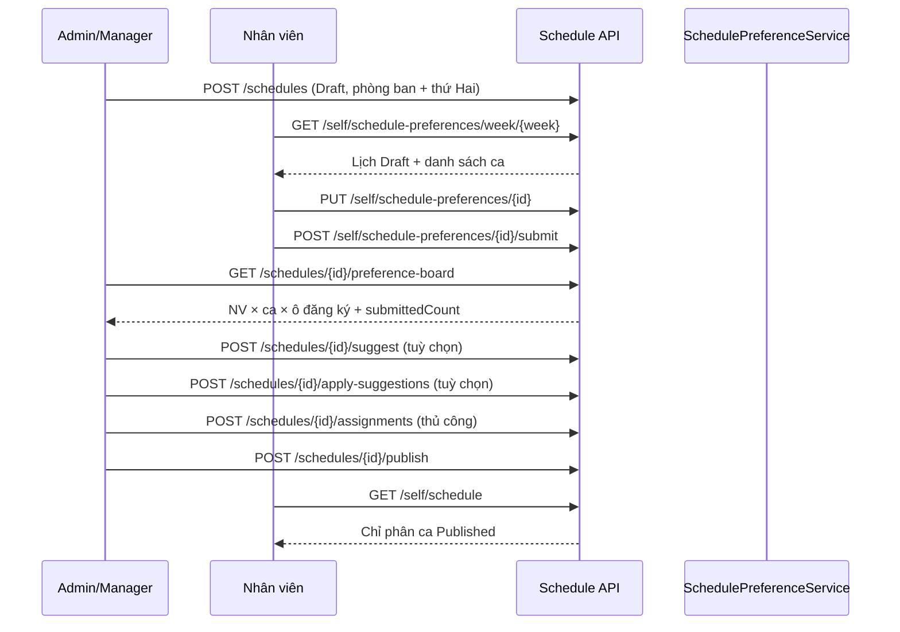

**UI:** Admin **Lịch ca** — stepper + **Bảng đăng ký ca** + **Công bố lịch**. NV **Lịch của tôi → Đăng ký ca** — chọn ô → **Lưu nháp** → **Gửi đăng ký**; tuần Published → chỉ xem; lịch chính thức ở tab **Lịch đã công bố**.

---

## 3. Tạo phân ca

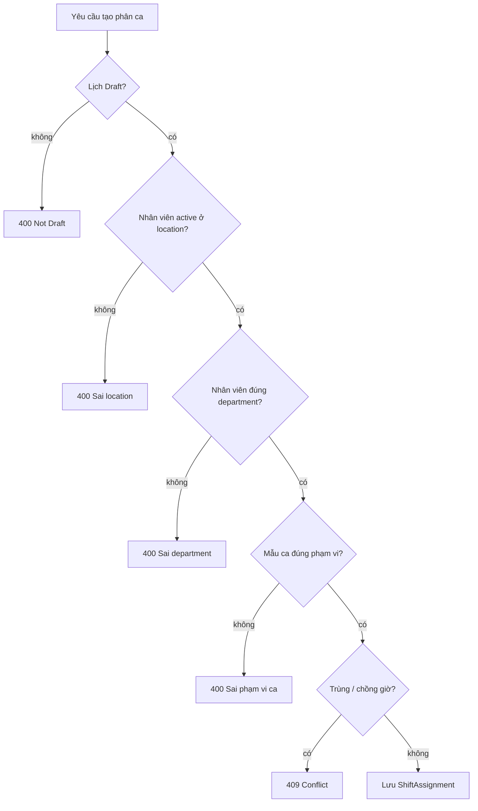

Validator dùng chung: `ScheduleService.TryPrepareAssignmentAsync` (phân ca thủ công + apply gợi ý).

---

## 4. Đổi ca (Swap)

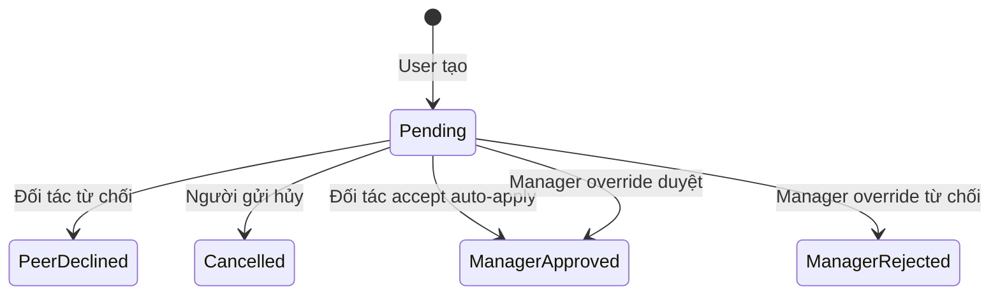

### Accept đồng nghiệp (nguyên tử)

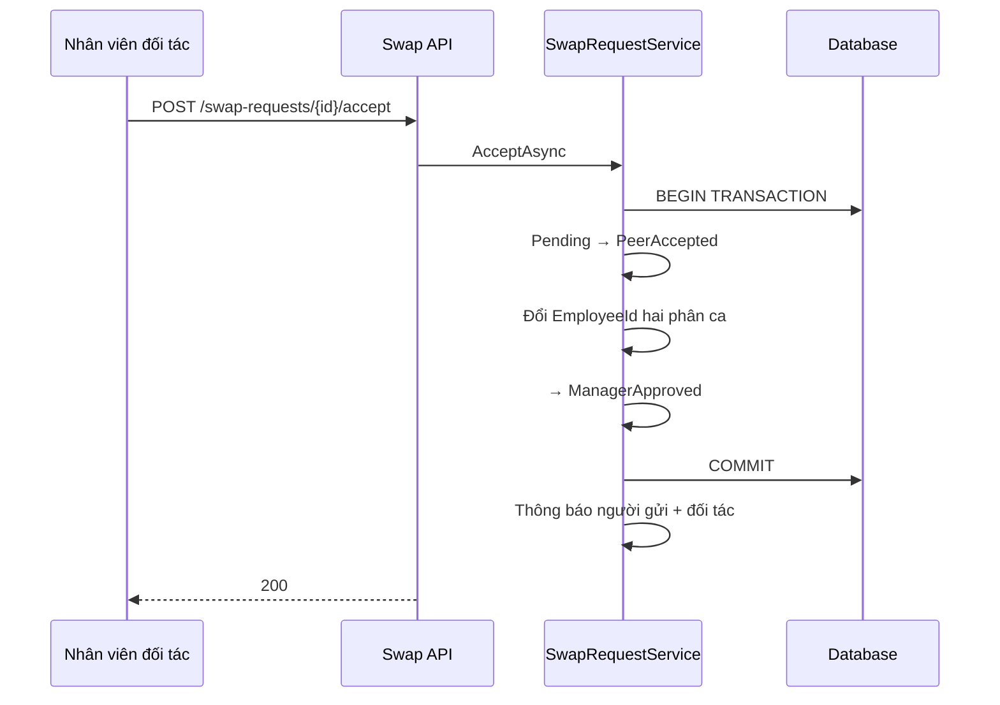

**BR-034**: cutoff theo `Date` phân ca và `Location.TimeZone`.

---

## 5. Chấm công

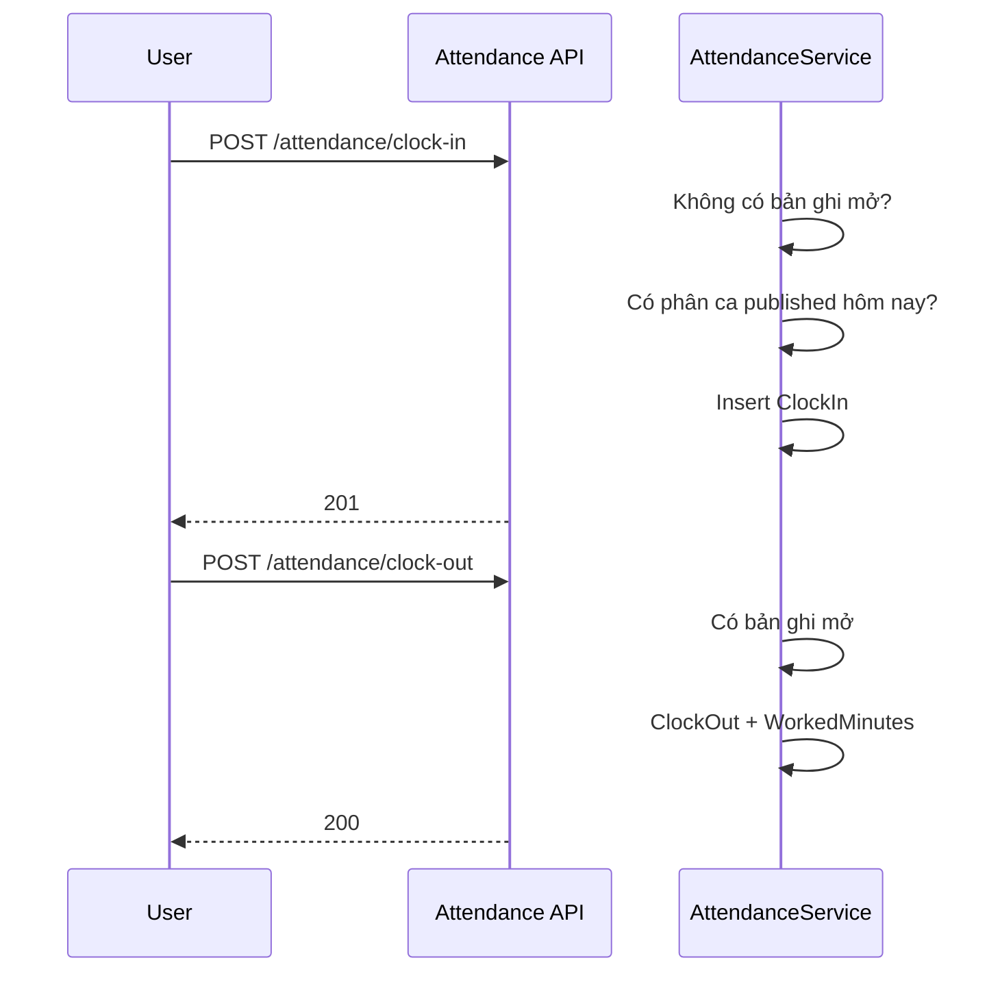

### Chặn điều chỉnh thủ công

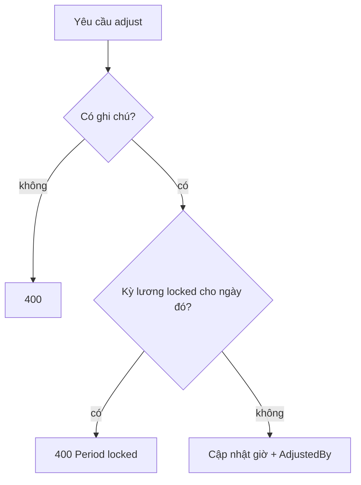

---

## 6. Tổng hợp lương

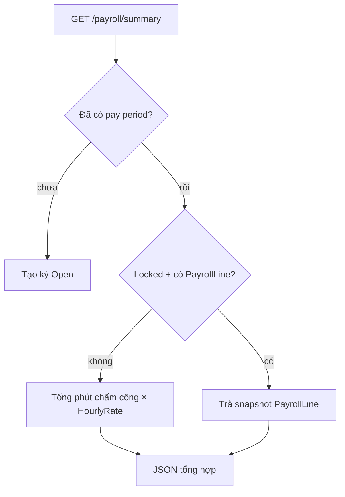

Export: `POST /payroll/summary/export` → CSV (Admin, tối đa 500 dòng).

---

## 7. Gợi ý lịch (CP-SAT)

Solver MVP = **CP-SAT only** (`useAi` trên suggest bị bỏ qua). Bedrock chỉ chat hỗ trợ (BR-077).

Luồng: suggest (đọc org policy + NV + ca + đăng ký **Submitted** + phân ca hiện có) → context JSON → Admin **Áp dụng** (explicit) → Publish. **Không auto-rebalance** khi NV đổi đăng ký sau apply (BR-086) — banner trên Lịch ca, Admin dùng lại **Tạo gợi ý AI**; CP-SAT chỉ mở khóa NV tự đổi đăng ký hoặc đang conflict Unavailable. Apply gợi ý theo tuple chính xác `(shiftDefinitionId, employeeId, date)`, nên nhiều NV có thể cùng ca/ngày nếu policy cho phép; chỉ xóa phân ca bị omit của nhóm NV bị ảnh hưởng khi request bật clear orphan tuple.

**Xin nghỉ (Draft):** NV `POST /self/leave-requests` → Manager duyệt → Unavailable + xóa phân ca conflict (BR-087).

### Trợ lý insight lịch (Bedrock hỗ trợ)

```mermaid
sequenceDiagram
    participant M as Manager
    participant API as Schedule API
    participant I as ScheduleInsightService
    participant B as AWS Bedrock

    M->>API: POST /schedules/{id}/suggest
    API->>I: GenerateContextAsync sau khi gợi ý thành công
    I->>I: Serialize luật, preference, phân ca, gợi ý, summary
    API-->>M: 200 danh sách gợi ý; context được refresh trong DB

    M->>API: POST /schedules/{id}/insights/chat
    API->>I: ChatAsync(câu hỏi)
    I->>B: Converse với context snapshot
    B-->>I: Giải thích hỗ trợ
    API-->>M: 200 câu trả lời
```

Bedrock không nằm trong bước sinh lịch hoặc apply. Nếu Bedrock không hoạt động, `suggest` và `apply-suggestions` vẫn chạy; chỉ endpoint chat lỗi độc lập.

---

## 8. Chat

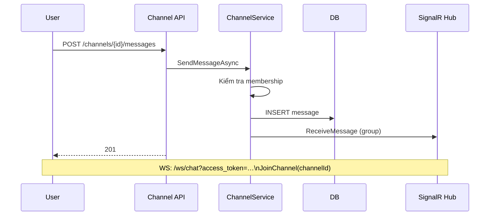

---

## 9. Cây quyết định cho agent (sửa code ở đâu)

| Loại thay đổi            | Tầng                                                   |
| ------------------------ | ------------------------------------------------------ |
| Quy tắc / validation mới | `Wokki.Application` service                            |
| Route HTTP mới           | `Wokki.Api/Apis/{Feature}/*Endpoints.cs`               |
| Truy vấn DB mới          | Interface repo `Wokki.Domain` + impl `Infrastructure`  |
| Message hiển thị         | `AppMessages` + service return                         |
| Trạng thái enum mới      | `Wokki.Domain.Enums` + chuyển trạng thái trong service |

Không đặt EF hay quy tắc nghiệp vụ trong handler `Wokki.Api`.
